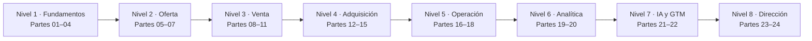

<div align="center">

# 📈 Marketing, Sales & Growth Evolution Program

## **336 clases · 24 partes · 1.256 horas · de fundamentos comerciales a dirección de ingresos**

**El programa de marketing, ventas y crecimiento más completo en español — desde investigación de mercado, posicionamiento y pricing hasta venta consultiva, RevOps, growth, analítica, IA comercial y el operating system de un CRO.**

[](https://github.com/vladimiracunadev-create/marketing-sales-growth-evolution-program/actions/workflows/ci.yml)
[](https://vladimiracunadev-create.github.io/marketing-sales-growth-evolution-program/)
[](https://github.com/vladimiracunadev-create/marketing-sales-growth-evolution-program/actions/workflows/security.yml)
[](https://github.com/vladimiracunadev-create/marketing-sales-growth-evolution-program/actions/workflows/codeql.yml)

[](CHANGELOG.md)
[](curriculum/README.md)
[](MANIFEST.md)
[](rutas/README.md)
[](LICENSE)

[🌐 Portal](https://vladimiracunadev-create.github.io/marketing-sales-growth-evolution-program/) ·
[📚 Índice de las 336 clases](curriculum/README.md) ·
[🧭 Rutas por rol](rutas/README.md) ·
[📅 Syllabus](SYLLABUS.md) ·
[📖 Glosario (1.344 términos)](docs/GLOSARIO.md) ·
[📐 Métricas (1.008 fichas)](docs/FORMULAS-Y-METRICAS.md) ·
[🗺️ Roadmap](ROADMAP.md) ·
[🤝 Contribuir](CONTRIBUTING.md) ·
[🔐 Seguridad](SECURITY.md)

**Cobertura por nivel:**
[Fundamentos](curriculum/part-01-marketing-y-ventas-fundamentos-del-sistema-comercial/README.md) ·
[Oferta y pricing](curriculum/part-07-pricing-y-monetizacion/README.md) ·
[Venta B2B](curriculum/part-09-venta-consultiva-y-b2b-compleja/README.md) ·
[Adquisición](curriculum/part-12-marketing-digital-y-adquisicion/README.md) ·
[RevOps](curriculum/part-17-marketing-automation-y-revenue-operations/README.md) ·
[Growth](curriculum/part-19-growth-marketing-y-growth-engineering/README.md) ·
[IA comercial](curriculum/part-21-ia-aplicada-a-marketing-ventas-y-servicio/README.md) ·
[Dirección](curriculum/part-23-direccion-comercial-cmo-vp-sales-y-cro/README.md)

</div>

---

> [!WARNING]
> **Cumplimiento y datos personales.** Los ejercicios usan **datos sintéticos** y no requieren clientes ni
> presupuesto real. Antes de aplicar cualquier contenido a una operación real, verifica la norma vigente en
> su fuente oficial: la Ley 19.496 del consumidor, el reglamento de comercio electrónico y la Ley 21.719 de
> datos personales imponen requisitos de diseño sobre campañas, listas, propuestas y automatizaciones. Este
> programa es formación aplicada, **no asesoría legal, tributaria ni financiera**.

## 🎯 Qué es esto

Un currículo **secuencial, basado en libros y orientado a evidencia**: 336 clases agrupadas en 24 partes,
desde el diagnóstico del motor de ingresos hasta la dirección de la función comercial completa. Cada clase
es un documento de 4.800 a 5.600 palabras, **redactado clase a clase** —no generado por plantilla— que incluye:

- 🚦 **Antes de empezar**: prerrequisitos, materiales, tiempo real y cómo saber que terminaste.
- 🎯 **Propósito** anclado a una decisión concreta, no a una definición.
- 🧩 **Conceptos con definición operacional**: dos personas independientes deben clasificar el mismo caso igual.
- 📐 **Fichas de medición**: numerador, denominador, ventana, fuente y lectura prohibida.
- 🧠 **Modelo mental** con el método por pasos y su **frontera de aplicación** explícita.
- 📚 **Lectura comparada** de cuatro obras, cada una anclada a **una idea concreta** con el capítulo donde buscarla.
- 🧮 **Ejemplo trabajado** sobre el caso persistente, con números concretos.
- 🏢 **Caso ejecutivo** que exige dos alternativas defendibles y una condición de revisión.
- ⚠️ **Errores frecuentes** (síntoma → causa → corrección).
- 🇨🇱 **Contexto normativo chileno** traducido a requisitos de diseño.
- 🧪 **Práctica guiada** con qué hacer, con qué material y **criterio de término por paso**.
- 🗝️ **Respuestas orientadoras**: qué debe contener una respuesta suficiente a cada pregunta.
- ✅ **Rúbrica publicada antes del trabajo** y 📗 **fuentes verificables**.

## ✅ Estado verificable

| Superficie | Cobertura |
|---|---|
| 📚 Currículo | 336/336 clases en 24 partes · 1.691.000 palabras · estándar `clase-profunda-v2` |
| 🧩 Conceptos | 1.344 términos con definición operacional, todos en el [glosario](docs/GLOSARIO.md) |
| 📐 Medición | 1.008 señales con ficha completa en [fórmulas y métricas](docs/FORMULAS-Y-METRICAS.md) |
| 📖 Bibliografía | 96 obras · 395 ideas catalogadas · **1.344 anclajes** clase a clase, auditados |
| 🧪 Práctica | 48 laboratorios con rúbrica de 100 puntos y escenario adverso obligatorio |
| 🏆 Evaluación | 24 evaluaciones de cuatro bloques ponderados + 12 proyectos + Capstone eliminatorio |
| 🧭 Rutas por rol | 17 guías de carrera con día a día, artefactos, progresión y rangos |
| 🖥️ Portal | 632 páginas HTML autocontenidas, buscador, modo oscuro y hoja de impresión |
| 🇨🇱 Regulación | Consumo, comercio electrónico, datos personales, marcas, tributación y libre competencia |
| 🔧 Calidad | 83 pruebas, 4 validadores, registro de fuentes con localizador comprobable, CI multi-OS/Python, CodeQL y verificación de reproducibilidad |

## 🗺️ El recorrido en 8 niveles



| Nivel | Partes | Competencia que construye |
|---|---:|---|
| 1️⃣ Fundamentos | 01–04 | Sistema comercial, cliente, investigación y posicionamiento |
| 2️⃣ Oferta comercial | 05–07 | Propuesta de valor, marca y arquitectura de monetización |
| 3️⃣ Venta | 08–11 | Proceso reproducible, venta consultiva, negociación y prospección |
| 4️⃣ Adquisición | 12–15 | Digital, contenido, medios pagados y comercio electrónico |
| 5️⃣ Operación de ingresos | 16–18 | CRM, RevOps y sistema de retención |
| 6️⃣ Crecimiento y analítica | 19–20 | Experimentación, cohortes, atribución e incrementalidad |
| 7️⃣ IA y expansión | 21–22 | IA con guardarraíles y go-to-market |
| 8️⃣ Dirección y Capstone | 23–24 | Operating system del CRO y empresa integrada |

## 🗂️ Las 24 partes

Cada parte tiene su **propio README** con la pregunta rectora, el caso, las competencias y sus 14 clases.

| # | Parte | Clases | Artefacto de portafolio | README |
|---:|---|---:|---|---|
| 01 | Marketing y ventas: fundamentos del sistema comercial | 14 | Mapa del motor de ingresos | [📘 leer](curriculum/part-01-marketing-y-ventas-fundamentos-del-sistema-comercial/README.md) |
| 02 | Cliente y comportamiento del consumidor | 14 | Expediente de cliente accionable | [📘 leer](curriculum/part-02-cliente-y-comportamiento-del-consumidor/README.md) |
| 03 | Investigación de mercados e inteligencia competitiva | 14 | Informe de oportunidad de mercado | [📘 leer](curriculum/part-03-investigacion-de-mercados-e-inteligencia-competitiva/README.md) |
| 04 | Segmentación, targeting y posicionamiento | 14 | Arquitectura STP probada | [📘 leer](curriculum/part-04-segmentacion-targeting-y-posicionamiento/README.md) |
| 05 | Producto, oferta y propuesta de valor | 14 | Oferta lista para vender | [📘 leer](curriculum/part-05-producto-oferta-y-propuesta-de-valor/README.md) |
| 06 | Marca, branding y comunicación estratégica | 14 | Brand book mínimo viable | [📘 leer](curriculum/part-06-marca-branding-y-comunicacion-estrategica/README.md) |
| 07 | Pricing y monetización | 14 | Arquitectura de monetización | [📘 leer](curriculum/part-07-pricing-y-monetizacion/README.md) |
| 08 | Fundamentos profesionales de ventas | 14 | Playbook comercial | [📘 leer](curriculum/part-08-fundamentos-profesionales-de-ventas/README.md) |
| 09 | Venta consultiva y B2B compleja | 14 | Deal review con mapa de cuenta | [📘 leer](curriculum/part-09-venta-consultiva-y-b2b-compleja/README.md) |
| 10 | Negociación comercial | 14 | Carpeta de negociación | [📘 leer](curriculum/part-10-negociacion-comercial/README.md) |
| 11 | Prospección y generación de demanda | 14 | Sistema de prospección repetible | [📘 leer](curriculum/part-11-prospeccion-y-generacion-de-demanda/README.md) |
| 12 | Marketing digital y adquisición | 14 | Plan de adquisición y auditoría | [📘 leer](curriculum/part-12-marketing-digital-y-adquisicion/README.md) |
| 13 | Contenido, copywriting y comunicación persuasiva | 14 | Sistema editorial completo | [📘 leer](curriculum/part-13-contenido-copywriting-y-comunicacion-persuasiva/README.md) |
| 14 | Publicidad y performance marketing | 14 | Plan de performance con umbrales | [📘 leer](curriculum/part-14-publicidad-y-performance-marketing/README.md) |
| 15 | E-commerce y marketplaces | 14 | Simulación de tienda rentable | [📘 leer](curriculum/part-15-e-commerce-y-marketplaces/README.md) |
| 16 | CRM, pipeline y sales operations | 14 | Diseño de sales operations | [📘 leer](curriculum/part-16-crm-pipeline-y-sales-operations/README.md) |
| 17 | Marketing automation y revenue operations | 14 | Operating model de RevOps | [📘 leer](curriculum/part-17-marketing-automation-y-revenue-operations/README.md) |
| 18 | Customer experience, success y fidelización | 14 | Sistema de retención y expansión | [📘 leer](curriculum/part-18-customer-experience-success-y-fidelizacion/README.md) |
| 19 | Growth marketing y growth engineering | 14 | Growth model completo | [📘 leer](curriculum/part-19-growth-marketing-y-growth-engineering/README.md) |
| 20 | Analítica comercial y marketing science | 14 | Caso analítico integral | [📘 leer](curriculum/part-20-analitica-comercial-y-marketing-science/README.md) |
| 21 | IA aplicada a marketing, ventas y servicio | 14 | Operating model humano-IA | [📘 leer](curriculum/part-21-ia-aplicada-a-marketing-ventas-y-servicio/README.md) |
| 22 | Go-to-market, canales y expansión | 14 | Plan GTM completo | [📘 leer](curriculum/part-22-go-to-market-canales-y-expansion/README.md) |
| 23 | Dirección comercial: CMO, VP Sales y CRO | 14 | Operating system del CRO | [📘 leer](curriculum/part-23-direccion-comercial-cmo-vp-sales-y-cro/README.md) |
| 24 | Empresa real, regulación y Capstone | 14 | Capstone con defensa ejecutiva | [📘 leer](curriculum/part-24-empresa-real-regulacion-y-capstone/README.md) |

➡️ **[Ver el índice completo del currículo](curriculum/README.md)**

## 🏢 El caso persistente

Todo el programa trabaja sobre **Ruta Andina SpA**, una empresa chilena que vende una plataforma de
agendamiento, pagos y CRM ligero a pymes de servicios. Tiene tres líneas de ingreso —suscripción, comercio
electrónico y contratos con el sector público—, lo que permite recorrer venta B2B recurrente, marketplace y
venta al Estado sin cambiar de contexto.

Su estado inicial deja el problema a la vista:

| Indicador | Valor | Por qué importa |
|---|---:|---|
| Cuentas activas | 240 | Base pequeña, cada baja pesa |
| Churn mensual de ingreso | 5,1 % | Mayor que el de cuentas: se van las grandes |
| Periodo de recuperación del CAC | 14 meses | **Mayor que la vida media del cliente** |
| Vida media del cliente | 11 meses | Cada cliente nuevo destruye caja antes de aportar |
| Activación a 14 días | 22 % | El 61 % de las bajas nunca completó la carga inicial |

Las decisiones de cada parte condicionan las siguientes; el estado acumulado vive en
[`simulations/state/`](simulations/state/).

## 🧪 Laboratorios y proyectos

| 🧭 Recorrido práctico | Qué produce |
|---|---|
| 🧪 **48 laboratorios** | Memo de decisión, cálculo, fichas de métricas y escenario adverso |
| 🏆 **24 evaluaciones** | Cuatro bloques ponderados: concepto, caso, método y fuentes |
| 📁 **24 casos extendidos** | Con complicación a mitad de sesión que obliga a recalcular |
| 🔗 **12 proyectos integradores** | Conectan dos partes y exigen resolver su contradicción |
| 🎓 **1 Capstone** | Empresa completa con cumplimiento normativo **eliminatorio** |

[Laboratorios](labs/) · [Evaluaciones](assessments/) · [Casos](cases/) · [Proyectos](projects/) ·
[Capstone](capstone/README.md)

## 🖥️ Portal de aprendizaje

El portal se genera desde el mismo Markdown del repositorio, así que no puede desincronizarse. Es
**autocontenido**: sin recursos externos, sin rastreadores y sin cuentas.

- 🔎 **Buscador** por título y por conceptos, operable por teclado.
- 🌗 **Tema claro, oscuro y según el sistema.**
- 🖨️ **Hoja de estilo de impresión** para estudiar en papel.
- 📊 **Panel de progreso** con clases, laboratorios y evaluaciones, exportable e importable.

[Abrir el portal](https://vladimiracunadev-create.github.io/marketing-sales-growth-evolution-program/) ·
[Abrir el currículo](https://vladimiracunadev-create.github.io/marketing-sales-growth-evolution-program/curriculum/index.html) ·
[Abrir el panel de progreso](https://vladimiracunadev-create.github.io/marketing-sales-growth-evolution-program/apps/learning-dashboard/index.html)

## 🧭 Rutas por rol

**17 guías de carrera completas.** Cada una explica qué es el puesto, cómo es un día real, qué hay que
saber, qué partes del programa lo preparan, qué artefactos lo acreditan, cómo progresa y qué mitos lo
rodean.

| Rol | Núcleo recomendado | Artefacto faro |
|---|---|---|
| 📊 **[Analista de marketing](rutas/analista-de-marketing.md)** | 01, 20, 16, 18 | Árbol de métricas y caso analítico |
| 🎯 **[Marketing manager](rutas/marketing-manager.md)** | 01, 02, 04, 06, 12 | Plan de adquisición con economía |
| 🧩 **[Product marketing](rutas/product-marketing.md)** | 02, 03, 04, 05 | Oferta con prueba de traspaso |
| 🚀 **[Growth manager](rutas/growth-manager.md)** | 18, 19, 20, 12 | Growth model con experimentos |
| 📞 **[SDR / BDR](rutas/sdr-bdr.md)** | 01, 02, 11, 08 | Sistema de prospección repetible |
| 🤝 **[Ejecutivo comercial](rutas/ejecutivo-comercial.md)** | 08, 09, 10, 16 | Deal review y carpeta de negociación |
| 🔁 **[Customer Success](rutas/customer-success.md)** | 02, 05, 18, 20 | Sistema de retención con health score |
| ⚙️ **[RevOps](rutas/revops.md)** | 16, 17, 20, 18 | Operating model con cifra única |
| 📈 **[Performance marketer](rutas/performance-marketer.md)** | 12, 14, 13, 20 | Plan con umbrales e incrementalidad |
| ✍️ **[Content manager](rutas/content-manager.md)** | 02, 04, 13, 12 | Sistema editorial con control |
| 🛒 **[E-commerce manager](rutas/ecommerce-manager.md)** | 15, 12, 07, 20 | Modelo económico de tienda |
| 🎨 **[Brand manager](rutas/brand-manager.md)** | 04, 06, 13, 20 | Brand book con medición |
| 🗺️ **[Head of GTM](rutas/head-of-gtm.md)** | 04, 05, 22, 23 | Plan GTM con capacidad declarada |
| 🏛️ **[CMO](rutas/cmo.md)** | 04, 06, 20, 23 | Presupuesto con supuestos |
| 🏅 **[VP de ventas](rutas/vp-sales.md)** | 08, 09, 16, 23 | Cuotas, territorios y forecast |
| 👑 **[CRO](rutas/cro.md)** | 16, 17, 18, 23, 24 | Operating system del CRO |
| 🚩 **[Founder](rutas/founder.md)** | 01–08, 11, 12, 24 | Capstone sobre empresa propia |

➡️ **[Ver todas las rutas con su guía completa](rutas/README.md)**

## 🏆 Evaluación verificable

La evaluación se apoya en **evidencia y defensa**, no en marcar temas como leídos.

| Dimensión | Evidencia mínima |
|---|---|
| 🔍 Diagnóstico | Problema formulado antes que la herramienta, con costo de no actuar |
| 📐 Medición | Ficha operacional completa, incluida la lectura prohibida |
| ⚖️ Decisión | Dos alternativas defendibles con costo de oportunidad y reversibilidad |
| 📚 Fuentes | Dos lecturas realmente usadas, con la tensión entre ellas explicitada |
| 🇨🇱 Cumplimiento | Obligación normativa traducida a requisito de diseño |
| 🗣️ Comunicación | Un tercero puede auditar el razonamiento sin el autor presente |

[Rúbricas y criterios](docs/EVALUACION-Y-RUBRICAS.md) ·
[Estándar de evidencia](docs/ESTANDAR-DE-EVIDENCIA.md) ·
[Estándar pedagógico](docs/ESTANDAR-PEDAGOGICO.md)

## 🚀 Cómo usar el programa

1. **Elige tu recorrido.** Empieza por la [ruta de aprendizaje](docs/RUTA-DE-APRENDIZAJE.md) o por una
   [ruta profesional](rutas/README.md) si ya sabes a qué puesto apuntas.
2. **Responde antes de leer.** Cada clase abre con una pregunta rectora: contéstala por escrito antes de
   seguir. La recuperación previa retiene más que cualquier resumen.
3. **No saltes el bloque de medición.** Construir la ficha de la métrica principal es donde más se aprende
   y lo primero que se omite.
4. **Produce dos alternativas.** Un entregable con una sola opción no cumple el estándar, aunque la opción
   sea correcta.
5. **Conserva la evidencia** en `evidence/` con la convención del
   [estándar de evidencia](docs/ESTANDAR-DE-EVIDENCIA.md).
6. **Aprueba antes de avanzar:** 80/100 en la evaluación de la parte y ningún bloque bajo 60 %.
7. **Cierra con el Capstone** y defiéndelo: el bloque de cumplimiento normativo es eliminatorio.

**Inicio local:**

```bash
git clone https://github.com/vladimiracunadev-create/marketing-sales-growth-evolution-program.git
cd marketing-sales-growth-evolution-program

python tools/validate_repository.py    # estructura, profundidad, idioma y bibliografía
python tools/build_site.py             # genera el portal en site/
python -m http.server 8000 --directory site
```

**Regenerar el contenido desde la especificación:**

```bash
python tools/build_curriculum.py       # 336 clases + índices + curriculum.json
python tools/build_practica.py         # 48 labs, 24 evaluaciones, 24 casos, 12 proyectos
python tools/build_rutas.py            # 17 rutas profesionales
python tools/build_docs.py             # glosario, métricas, bibliografía, syllabus, manifiesto
python tools/build_bibliography_json.py # registro de fuentes con ISBN-13, DOI y URL
python tools/build_readme_bibliografia.py # resumen del registro en esta portada
python tools/build_status.py           # estado verificable del repositorio
```

Los generadores usan **sólo la biblioteca estándar de Python**: construir y validar el material no exige
instalar nada.

## ✅ Calidad y CI

El repositorio no se publica a ciegas. Cada `push` y cada pull request pasan por integración continua que
valida estructura, profundidad, idioma, enlaces y reproducibilidad. **Nada llega a `main` en rojo**, y el
portal se verifica **después** de publicarse.

| ⚙️ Workflow | Qué cubre |
|---|---|
| 🧪 [ci.yml](.github/workflows/ci.yml) | Validadores, pruebas y compatibilidad en Linux, macOS y Windows con Python 3.9–3.13 |
| 🔁 [ci.yml · reproducibilidad](.github/workflows/ci.yml) | Regenera el contenido y falla si difiere de lo confirmado |
| 🚀 [pages.yml](.github/workflows/pages.yml) | Construye, valida y publica el portal — y comprueba el sitio **ya desplegado** |
| 🔒 [security.yml](.github/workflows/security.yml) | Dependencias, secretos, datos sintéticos y ausencia de recursos externos |
| 🔎 [codeql.yml](.github/workflows/codeql.yml) | Análisis estático de seguridad sobre las herramientas |
| 📚 [fuentes.yml](.github/workflows/fuentes.yml) | Resuelve cada ISBN, DOI y URL del registro contra la red. **Informa; no bloquea** |

Los mismos validadores corren en local antes de subir:

```bash
python tools/validate_repository.py   # 336 clases, secciones obligatorias e idioma
python tools/validate_depth.py        # profundidad mínima por clase, lab, evaluación y caso
python tools/check_links.py           # enlaces internos
python tools/validate_site.py         # artefacto del portal completo
python scripts/verify_sources.py      # registro de fuentes: ISBN, DOI, cobertura y cifras del README
python -m pytest -q                   # 83 pruebas
```

## 👩‍🏫 Para instructores

El programa está listo para migrar a capacitación **sin reescribir contenido**: cada clase trae agenda por
tramos de 150 minutos, rúbrica publicada y caso con complicación. Hay formatos de 45, 90 y 150 minutos,
taller intensivo de dos días y programa completo de doce meses.

[📐 Metodología](docs/METODOLOGIA.md) ·
[👩‍🏫 Guía docente](docs/GUIA-DOCENTE.md) ·
[🎓 Plan de capacitación y migración a LMS](docs/PLAN-DE-CAPACITACION.md) ·
[♿ Accesibilidad](docs/ACCESIBILIDAD.md)

<!-- BIBLIOGRAFIA:INICIO -->

## 📚 Bibliografía: qué está comprobado y qué es atribución

Estas son las **96 obras** sobre las que se apoya el programa. Antes de la lista conviene separar dos cosas que las bibliografías suelen mezclar, porque de esa mezcla salen las citas que nadie puede comprobar.

**Comprobado:** que cada obra existe y cuál es exactamente la edición. Los 94 localizadores resuelven contra el catálogo de OpenLibrary, contra doi.org o contra el sitio del organismo emisor, y se revalidan periódicamente. Eso es un hecho verificable y cualquiera puede repetir la comprobación.

**Atribución del programa:** que la idea que cada clase señala esté en el capítulo que indica. De estas obras se catalogaron **395 ideas**, y las 336 clases declaran cuál de ellas sostiene cada una de sus citas —**1344 anclajes**—. Esa atribución es la lectura que el programa hace de cada obra; **no está cotejada frase por frase contra el texto**, y se declara con este detalle justamente para que se pueda contrastar. Si abres una obra y la idea no está donde se dice, la cita está mal puesta y corresponde reportarlo como error del material. En los términos del [estándar de evidencia](docs/ESTANDAR-DE-EVIDENCIA.md) del propio programa: el localizador es un hecho verificado; la atribución, una inferencia declarada.

**Qué cuesta comprobarlo.** De las 96 obras, **2** se pueden leer completas y gratis en su fuente; **3** están publicadas por su editor pero con acceso limitado o de pago; **1** es una norma que hay que comprar al organismo emisor; y **90** son libros comerciales: se compran o se piden en biblioteca. El programa no distribuye ninguna: las cita, las contrasta y enseña a usarlas de forma selectiva.

La excepción son las normas chilenas, que sí se pueden leer completas y gratis: cada clase enlaza el texto oficial en Ley Chile, con el título tal como lo publica la Biblioteca del Congreso Nacional. Ahí no hay nada que creer.

<!-- REGISTRO-FUENTES:INICIO -->

| Estado del registro de fuentes | Valor |
|---|---:|
| entradas del registro | **96** |
| obras con localizador verificado | **94** |
| libros con ISBN-13 | **89** |
| entradas pendientes | **2** |

Última revalidación contra openlibrary.org y las fuentes oficiales: **2026-08-19**.

<!-- REGISTRO-FUENTES:FIN -->

> [!NOTE]
> Estas cifras las produce `python scripts/verify_sources.py`, que falla si el README declara otras. No se escriben a mano. El registro completo, con el uso de cada obra clase a clase, está en [`sources/bibliography.json`](sources/bibliography.json).

> [!NOTE]
> Nunca se citan números de página: cambian entre ediciones y el programa no puede garantizarlas. El anclaje indica el capítulo o la sección **por su nombre dentro de la obra**. Por la misma razón cada obra enlaza a su localizador: para que no tengas que adivinar de qué edición se está hablando.

El programa **no distribuye** ninguna de estas obras: las cita, las contrasta y enseña a usarlas de forma selectiva. Toda la redacción es original y no reproduce sus textos. El acceso debe obtenerse por biblioteca, editorial, librería o suscripción legítima.

### Marketing

| Autoría | Obra | Edición | Qué aporta al programa | Clases | Localizador | Acceso |
|---|---|---|---|---:|---|---|
| Seth Godin | [*This Is Marketing*](https://openlibrary.org/isbn/9780525540830) | 2018 | marketing como servicio a un público mínimo viable y construcción de confianza | 30 | ISBN 9780525540830 | comprar o biblioteca |
| Philip Kotler, Kevin Lane Keller y Alexander Chernev | [*Marketing Management*](https://openlibrary.org/isbn/9780136708643) | 2021, 16.ª ed. | estructura canónica del marketing: análisis, STP, mezcla comercial y gestión de la demanda | 21 | ISBN 9780136708643 | comprar o biblioteca |
| Les Binet y Peter Field | [*The Long and the Short of It*](https://openlibrary.org/isbn/9780852941348) | 2013 | equilibrio entre construcción de marca a largo plazo y activación de ventas a corto plazo | 14 | ISBN 9780852941348 | comprar o biblioteca |
| Al Ries y Jack Trout | [*Positioning: The Battle for Your Mind*](https://openlibrary.org/isbn/9780071359160) | 2001, ed. revisada | posicionamiento como lugar en la mente del cliente y no como declaración interna | 11 | ISBN 9780071359160 | comprar o biblioteca |
| Jenni Romaniuk y Byron Sharp | [*How Brands Grow: Part 2*](https://openlibrary.org/isbn/9780195596267) | 2015 | activos distintivos de marca, alcance y aplicación de las leyes empíricas a mercados emergentes | 10 | ISBN 9780195596267 | comprar o biblioteca |
| Byron Sharp | [*How Brands Grow*](https://openlibrary.org/isbn/9780195573565) | 2010 | evidencia empírica sobre penetración, disponibilidad mental y física y crecimiento de marcas | 7 | ISBN 9780195573565 | comprar o biblioteca |
| Theodore Levitt | [*Marketing Myopia (Harvard Business Review)*](https://hbr.org/2004/07/marketing-myopia) | 1960 | definir el negocio por el trabajo del cliente y no por el producto que se fabrica | 1 | fuente primaria | acceso limitado |

### Estrategia y competencia

| Autoría | Obra | Edición | Qué aporta al programa | Clases | Localizador | Acceso |
|---|---|---|---|---:|---|---|
| Geoffrey A. Moore | [*Crossing the Chasm*](https://openlibrary.org/isbn/9780062293008) | 2014, 3.ª ed. | adopción tecnológica, beachhead market y el abismo entre visionarios y pragmáticos | 25 | ISBN 9780062293008 | comprar o biblioteca |
| Richard Rumelt | [*Good Strategy / Bad Strategy*](https://openlibrary.org/isbn/9781846684807) | 2011 | diagnóstico, política rectora y acción coherente frente a la estrategia decorativa | 21 | ISBN 9781846684807 | comprar o biblioteca |
| Michael E. Porter | [*Competitive Strategy*](https://openlibrary.org/isbn/9780029253601) | 1980 | estructura de industria, fuerzas competitivas y elección de una posición defendible | 18 | ISBN 9780029253601 | comprar o biblioteca |
| Michael E. Porter | [*What Is Strategy? (Harvard Business Review)*](https://hbr.org/1996/11/what-is-strategy) | 1996 | estrategia como sistema de actividades coherentes y elección explícita de qué no hacer | 6 | fuente primaria | acceso limitado |
| W. Chan Kim y Renée Mauborgne | [*Blue Ocean Strategy*](https://openlibrary.org/isbn/9781625274496) | 2015, ed. ampliada | reconstrucción de las fronteras del mercado y curva de valor | 3 | ISBN 9781625274496 | comprar o biblioteca |
| Alexander Osterwalder e Yves Pigneur | [*Business Model Generation*](https://openlibrary.org/isbn/9780470876411) | 2010 | modelo de negocio como sistema de nueve bloques interdependientes | 2 | ISBN 9780470876411 | comprar o biblioteca |
| Peter F. Drucker | [*The Practice of Management*](https://openlibrary.org/isbn/9780060110956) | 1954 | el propósito de una empresa es crear un cliente; marketing e innovación como funciones centrales | 1 | ISBN 9780060110956 | comprar o biblioteca |

### Cliente y trabajo por resolver

| Autoría | Obra | Edición | Qué aporta al programa | Clases | Localizador | Acceso |
|---|---|---|---|---:|---|---|
| Clayton M. Christensen, Taddy Hall, Karen Dillon y David S. Duncan | [*Competing Against Luck*](https://openlibrary.org/isbn/9780062435613) | 2016 | Jobs to Be Done: el progreso que el cliente intenta lograr y el circuito de contratación | 8 | ISBN 9780062435613 | comprar o biblioteca |
| Anthony W. Ulwick | [*Jobs to Be Done: Theory to Practice*](https://openlibrary.org/isbn/9780990576747) | 2016 | outcome-driven innovation: resultados deseados medibles y priorización por oportunidad | 2 | ISBN 9780990576747 | comprar o biblioteca |

### Investigación de mercados

| Autoría | Obra | Edición | Qué aporta al programa | Clases | Localizador | Acceso |
|---|---|---|---|---:|---|---|
| Naresh K. Malhotra | [*Marketing Research: An Applied Orientation*](https://openlibrary.org/isbn/9781292265636) | 2019, 7.ª ed. | diseño de investigación, muestreo, medición y análisis con rigor metodológico | 15 | ISBN 9781292265636 | comprar o biblioteca |
| Rob Fitzpatrick | [*The Mom Test*](https://openlibrary.org/isbn/9781492180746) | 2013 | entrevistas que producen datos y no cortesía; preguntar por comportamiento pasado | 15 | ISBN 9781492180746 | comprar o biblioteca |
| Steve Blank y Bob Dorf | [*The Startup Owner's Manual*](https://openlibrary.org/isbn/9780984999385) | 2012 | customer discovery y validación fuera del edificio como proceso reproducible | 9 | ISBN 9780984999385 | comprar o biblioteca |
| Steve Portigal | [*Interviewing Users*](https://openlibrary.org/isbn/9781959029823) | 2023, 2.ª ed. | conducción de entrevistas, escucha activa y traducción de observación en decisión | 6 | ISBN 9781959029823 | comprar o biblioteca |

### Comportamiento y decisión

| Autoría | Obra | Edición | Qué aporta al programa | Clases | Localizador | Acceso |
|---|---|---|---|---:|---|---|
| Robert B. Cialdini | [*Influence: The Psychology of Persuasion, New and Expanded*](https://openlibrary.org/isbn/9780062937650) | 2021 | principios de influencia y su uso ético en contextos comerciales | 22 | ISBN 9780062937650 | comprar o biblioteca |
| Michael R. Solomon | [*Consumer Behavior: Buying, Having, and Being*](https://openlibrary.org/isbn/9781292318103) | 2019, 13.ª ed. | marco académico del comportamiento del consumidor: cultura, identidad y proceso de decisión | 7 | ISBN 9781292318103 | comprar o biblioteca |
| Dan Ariely | [*Predictably Irrational*](https://openlibrary.org/isbn/9780061353239) | 2008 | efectos de anclaje, gratuidad y comparación en la percepción de valor | 4 | ISBN 9780061353239 | comprar o biblioteca |
| Richard H. Thaler y Cass R. Sunstein | [*Nudge: The Final Edition*](https://openlibrary.org/isbn/9780143137009) | 2021 | arquitectura de decisión y límites éticos de la influencia sobre la elección | 4 | ISBN 9780143137009 | comprar o biblioteca |
| Daniel Kahneman | [*Thinking, Fast and Slow*](https://openlibrary.org/isbn/9780141918921) | 2011 | sistemas 1 y 2, heurísticas y sesgos aplicables a decisiones de compra y de gestión | 2 | ISBN 9780141918921 | comprar o biblioteca |

### Marca

| Autoría | Obra | Edición | Qué aporta al programa | Clases | Localizador | Acceso |
|---|---|---|---|---:|---|---|
| Kevin Lane Keller y Vanitha Swaminathan | [*Strategic Brand Management*](https://openlibrary.org/isbn/9780134892498) | 2019, 5.ª ed. | modelo CBBE: notoriedad, significado, respuesta y resonancia de marca | 13 | ISBN 9780134892498 | comprar o biblioteca |
| David A. Aaker | [*Building Strong Brands*](https://openlibrary.org/isbn/9780029001516) | 1996 | brand equity, identidad de marca y arquitectura de portafolio | 12 | ISBN 9780029001516 | comprar o biblioteca |
| Alina Wheeler y Rob Meyerson | [*Designing Brand Identity*](https://openlibrary.org/isbn/9781119984825) | 2024, 6.ª ed. | proceso de identidad de marca: investigación, diseño, aplicación y gobierno | 7 | ISBN 9781119984825 | comprar o biblioteca |

### Comunicación e identidad

| Autoría | Obra | Edición | Qué aporta al programa | Clases | Localizador | Acceso |
|---|---|---|---|---:|---|---|
| Chip Heath y Dan Heath | [*Made to Stick*](https://openlibrary.org/isbn/9781400064281) | 2007 | ideas que se recuerdan: simplicidad, concreción, credibilidad y emoción | 12 | ISBN 9781400064281 | comprar o biblioteca |

### Contenido y copywriting

| Autoría | Obra | Edición | Qué aporta al programa | Clases | Localizador | Acceso |
|---|---|---|---|---:|---|---|
| Ann Handley | [*Everybody Writes*](https://openlibrary.org/isbn/9781119854319) | 2022, 2.ª ed. | estándar editorial: claridad, utilidad y empatía en la escritura comercial | 31 | ISBN 9781119854319 | comprar o biblioteca |
| Joseph Sugarman | [*The Adweek Copywriting Handbook*](https://openlibrary.org/isbn/9780470051245) | 2007 | mecánica del copy persuasivo: ritmo, curiosidad y coherencia de la promesa | 10 | ISBN 9780470051245 | comprar o biblioteca |
| Joe Pulizzi | [*Content Inc.*](https://openlibrary.org/isbn/9781264257546) | 2021, 2.ª ed. | construcción de audiencia propia antes de monetizar y modelo editorial sostenido | 6 | ISBN 9781264257546 | comprar o biblioteca |

### Publicidad

| Autoría | Obra | Edición | Qué aporta al programa | Clases | Localizador | Acceso |
|---|---|---|---|---:|---|---|
| Brad Geddes | [*Advanced Google AdWords*](https://openlibrary.org/isbn/9781118819647) | 2014, 3.ª ed. | estructura de cuentas, subastas, calidad y control del gasto en búsqueda pagada | 13 | ISBN 9781118819647 | comprar o biblioteca |
| David Ogilvy | [*Ogilvy on Advertising*](https://openlibrary.org/isbn/9780517550755) | 1983 | disciplina publicitaria basada en investigación, oferta clara y respeto por el lector | 6 | ISBN 9780517550755 | comprar o biblioteca |

### Precio y monetización

| Autoría | Obra | Edición | Qué aporta al programa | Clases | Localizador | Acceso |
|---|---|---|---|---:|---|---|
| Thomas T. Nagle y Georg Müller | [*The Strategy and Tactics of Pricing*](https://openlibrary.org/isbn/9781138737501) | 2018, 6.ª ed. | pricing basado en valor, estructura de precios, métrica de cobro y política de descuentos | 30 | ISBN 9781138737501 | comprar o biblioteca |
| Madhavan Ramanujam y Georg Tacke | [*Monetizing Innovation*](https://openlibrary.org/isbn/9781119240877) | 2016 | diseñar el producto alrededor del precio: disposición a pagar antes de construir | 16 | ISBN 9781119240877 | comprar o biblioteca |
| Hermann Simon | [*Confessions of the Pricing Man*](https://openlibrary.org/isbn/9783319204000) | 2015 | el precio como la palanca de utilidad más rápida y su relación con el valor percibido | 14 | ISBN 9783319204000 | comprar o biblioteca |
| Tim J. Smith | [*Pricing Strategy*](https://openlibrary.org/isbn/9781111571290) | 2011 | segmentación de precios, price fences y decisiones de estructura | 6 | ISBN 9781111571290 | comprar o biblioteca |

### Oferta y producto

| Autoría | Obra | Edición | Qué aporta al programa | Clases | Localizador | Acceso |
|---|---|---|---|---:|---|---|
| Alexander Osterwalder, Yves Pigneur, Greg Bernarda y Alan Smith | [*Value Proposition Design*](https://openlibrary.org/isbn/9781118968055) | 2014 | encaje entre perfil del cliente y mapa de valor; prueba de propuestas antes de construir | 6 | ISBN 9781118968055 | comprar o biblioteca |

### Gestión de producto

| Autoría | Obra | Edición | Qué aporta al programa | Clases | Localizador | Acceso |
|---|---|---|---|---:|---|---|
| Marty Cagan | [*Inspired*](https://openlibrary.org/isbn/9781119387541) | 2017, 2.ª ed. | descubrimiento de producto y riesgos de valor, usabilidad, viabilidad y factibilidad | 20 | ISBN 9781119387541 | comprar o biblioteca |
| Samuel Hulick | *The Elements of User Onboarding* | 2014 | diseño del primer valor percibido y reducción del time-to-value | 6 | fuente primaria | comprar o biblioteca |

### Ventas

| Autoría | Obra | Edición | Qué aporta al programa | Clases | Localizador | Acceso |
|---|---|---|---|---:|---|---|
| Mark Roberge | [*The Sales Acceleration Formula*](https://openlibrary.org/isbn/9781119047018) | 2015 | contratación, formación, gestión y demanda comercial gobernadas por datos | 51 | ISBN 9781119047018 | comprar o biblioteca |
| Aaron Ross y Marylou Tyler | [*Predictable Revenue*](https://openlibrary.org/isbn/9780984380213) | 2011 | especialización de roles comerciales y generación de pipeline predecible | 24 | ISBN 9780984380213 | comprar o biblioteca |
| Neil Rackham | [*SPIN Selling*](https://openlibrary.org/isbn/9780070511132) | 1988 | investigación conductual sobre venta compleja: situación, problema, implicación y necesidad-beneficio | 24 | ISBN 9780070511132 | comprar o biblioteca |
| Robert B. Miller y Stephen E. Heiman | [*The New Strategic Selling*](https://openlibrary.org/isbn/9780446695190) | 2005 | mapa de influencias, roles de compra y análisis de posición en cuentas complejas | 17 | ISBN 9780446695190 | comprar o biblioteca |
| Jeb Blount | [*Fanatical Prospecting*](https://openlibrary.org/isbn/9781119176305) | 2015 | disciplina de prospección, cadencia y gestión del rechazo | 15 | ISBN 9781119176305 | comprar o biblioteca |
| Keenan | [*Gap Selling*](https://openlibrary.org/isbn/9781732891005) | 2018 | vender la brecha entre estado actual y estado futuro con diagnóstico riguroso | 14 | ISBN 9781732891005 | comprar o biblioteca |
| Brent Adamson y Matthew Dixon | [*The Challenger Customer*](https://openlibrary.org/isbn/9780241196564) | 2015 | comité de compra, mobilizer y construcción de consenso interno del cliente | 12 | ISBN 9780241196564 | comprar o biblioteca |
| Mike Weinberg | [*New Sales. Simplified.*](https://openlibrary.org/isbn/9780814431788) | 2012 | proceso de nueva venta: lista objetivo, relato comercial y actividad sostenida | 8 | ISBN 9780814431788 | comprar o biblioteca |
| Trish Bertuzzi | [*The Sales Development Playbook*](https://openlibrary.org/isbn/9780692622032) | 2016 | estructura, especialización y métricas del equipo de desarrollo de ventas | 8 | ISBN 9780692622032 | comprar o biblioteca |
| Matthew Dixon y Brent Adamson | [*The Challenger Sale*](https://openlibrary.org/isbn/9781591844358) | 2011 | enseñar, adaptar y tomar el control; el insight comercial como diferenciador | 7 | ISBN 9781591844358 | comprar o biblioteca |
| Gary Vaynerchuk | [*Jab, Jab, Jab, Right Hook*](https://openlibrary.org/isbn/9780062273079) | 2013 | secuencia de aporte de valor antes de la petición comercial en canales sociales | 2 | ISBN 9780062273079 | comprar o biblioteca |

### Negociación

| Autoría | Obra | Edición | Qué aporta al programa | Clases | Localizador | Acceso |
|---|---|---|---|---:|---|---|
| Deepak Malhotra y Max H. Bazerman | [*Negotiation Genius*](https://openlibrary.org/isbn/9780553804881) | 2007 | preparación analítica, ZOPA, valor creado frente a valor reclamado y ética negociadora | 16 | ISBN 9780553804881 | comprar o biblioteca |
| Roger Fisher, William Ury y Bruce Patton | [*Getting to Yes*](https://openlibrary.org/isbn/9781101539545) | 2011, 3.ª ed. | negociación por principios: intereses, opciones, criterios objetivos y BATNA | 16 | ISBN 9781101539545 | comprar o biblioteca |
| G. Richard Shell | [*Bargaining for Advantage*](https://openlibrary.org/isbn/9780143036975) | 2006 | estilos de negociación, autoridad y estándares de legitimidad | 14 | ISBN 9780143036975 | comprar o biblioteca |
| Chris Voss y Tahl Raz | [*Never Split the Difference*](https://openlibrary.org/isbn/9781473535169) | 2016 | empatía táctica, etiquetado y preguntas calibradas bajo presión | 5 | ISBN 9781473535169 | comprar o biblioteca |
| William Ury | [*Getting Past No*](https://openlibrary.org/isbn/9780553903645) | 2007 | manejo de tácticas duras, reencuadre y construcción de puentes | 4 | ISBN 9780553903645 | comprar o biblioteca |

### Marketing digital y conversión

| Autoría | Obra | Edición | Qué aporta al programa | Clases | Localizador | Acceso |
|---|---|---|---|---:|---|---|
| Dave Chaffey y Fiona Ellis-Chadwick | [*Digital Marketing*](https://openlibrary.org/isbn/9781292400990) | 2022, 8.ª ed. | planificación digital integrada: canales, medición y gobierno | 32 | ISBN 9781292400990 | comprar o biblioteca |
| Peep Laja y el equipo de CXL | [*Conversion Optimization Playbooks (CXL)*](https://cxl.com/institute/) | 2024 | método CRO basado en investigación previa al test y validez estadística | 16 | fuente primaria | acceso limitado |
| Steve Krug | [*Don't Make Me Think, Revisited*](https://openlibrary.org/isbn/9780321965516) | 2014 | usabilidad, claridad y pruebas baratas con usuarios reales | 16 | ISBN 9780321965516 | comprar o biblioteca |
| Bryan Eisenberg y Jeffrey Eisenberg | [*Call to Action*](https://openlibrary.org/isbn/9781932226393) | 2005 | optimización de conversión con hipótesis, escenarios y persuasión medible | 11 | ISBN 9781932226393 | comprar o biblioteca |
| Eric Enge, Stephan Spencer y Jessie Stricchiola | [*The Art of SEO*](https://openlibrary.org/isbn/9781098102616) | 2023, 4.ª ed. | arquitectura, contenido y autoridad como sistema de búsqueda orgánica | 3 | ISBN 9781098102616 | comprar o biblioteca |

### Comercio digital

| Autoría | Obra | Edición | Qué aporta al programa | Clases | Localizador | Acceso |
|---|---|---|---|---:|---|---|
| Kevin Hillstrom | [*Hillstrom's Multichannel Forensics*](https://openlibrary.org/isbn/9780977148950) | 2007 | diagnóstico de comportamiento de compra multicanal y migración de clientes | 16 | ISBN 9780977148950 | comprar o biblioteca |

### Crecimiento y experimentación

| Autoría | Obra | Edición | Qué aporta al programa | Clases | Localizador | Acceso |
|---|---|---|---|---:|---|---|
| Sean Ellis y Morgan Brown | [*Hacking Growth*](https://openlibrary.org/isbn/9780451497215) | 2017 | equipo multifuncional, ciclo de experimentación y aha moment | 18 | ISBN 9780451497215 | comprar o biblioteca |
| Gabriel Weinberg y Justin Mares | [*Traction*](https://openlibrary.org/isbn/9780241242551) | 2015 | diecinueve canales de tracción y el método bullseye de priorización | 10 | ISBN 9780241242551 | comprar o biblioteca |
| Wes Bush | [*Product-Led Growth*](https://openlibrary.org/isbn/9781777119317) | 2019 | el producto como principal vehículo de adquisición, activación y expansión | 9 | ISBN 9781777119317 | comprar o biblioteca |
| Eric Ries | [*The Lean Startup*](https://openlibrary.org/isbn/9780670921607) | 2011 | construir-medir-aprender, MVP y decisión de perseverar o pivotar | 8 | ISBN 9780670921607 | comprar o biblioteca |

### Retención y éxito de cliente

| Autoría | Obra | Edición | Qué aporta al programa | Clases | Localizador | Acceso |
|---|---|---|---|---:|---|---|
| Nick Mehta, Dan Steinman y Lincoln Murphy | [*Customer Success*](https://openlibrary.org/isbn/9781119168294) | 2016 | disciplina operativa de éxito de cliente: salud, renovación y expansión | 26 | ISBN 9781119168294 | comprar o biblioteca |
| Peter Fader | [*Customer Centricity*](https://openlibrary.org/isbn/9781613631447) | 2020, 2.ª ed. | valor heterogéneo del cliente y asignación de recursos por valor esperado | 19 | ISBN 9781613631447 | comprar o biblioteca |
| Matthew Dixon, Nick Toman y Rick DeLisi | [*The Effortless Experience*](https://openlibrary.org/isbn/9780241003305) | 2013 | reducción del esfuerzo del cliente como motor de lealtad frente al deleite | 18 | ISBN 9780241003305 | comprar o biblioteca |
| Fred Reichheld, Darci Darnell y Maureen Burns | [*Winning on Purpose*](https://openlibrary.org/isbn/9781647821784) | 2021 | lealtad, economía del cliente ganado y usos correctos e incorrectos del NPS | 16 | ISBN 9781647821784 | comprar o biblioteca |
| Peter Fader y Sarah Toms | [*The Customer Centricity Playbook*](https://openlibrary.org/isbn/9781613630914) | 2018 | modelos de valor de vida del cliente y decisiones de inversión por cohorte | 10 | ISBN 9781613630914 | comprar o biblioteca |

### Operaciones de ingresos

| Autoría | Obra | Edición | Qué aporta al programa | Clases | Localizador | Acceso |
|---|---|---|---|---:|---|---|
| Stephen G. Diorio y Chris K. Hummel | [*Revenue Operations*](https://openlibrary.org/isbn/9781119871132) | 2022 | integración de datos, procesos y equipos que producen ingreso como un solo sistema | 29 | ISBN 9781119871132 | comprar o biblioteca |

### Analítica y medición

| Autoría | Obra | Edición | Qué aporta al programa | Clases | Localizador | Acceso |
|---|---|---|---|---:|---|---|
| Foster Provost y Tom Fawcett | [*Data Science for Business*](https://openlibrary.org/isbn/9781449374280) | 2013 | pensamiento analítico: formulación del problema, evaluación y valor esperado | 56 | ISBN 9781449374280 | comprar o biblioteca |
| Alistair Croll y Benjamin Yoskovitz | [*Lean Analytics*](https://openlibrary.org/isbn/9781449335670) | 2013 | una métrica que importa por etapa y por modelo de negocio | 53 | ISBN 9781449335670 | comprar o biblioteca |
| Avinash Kaushik | [*Web Analytics 2.0*](https://openlibrary.org/isbn/9780470596425) | 2009 | medición orientada a decisión, segmentación y crítica del dato de vanidad | 38 | ISBN 9780470596425 | comprar o biblioteca |
| Ron Kohavi, Diane Tang y Ya Xu | [*Trustworthy Online Controlled Experiments*](https://openlibrary.org/isbn/9781108601375) | 2020 | diseño estadístico de experimentos, métricas guardrail y trampas de interpretación | 27 | ISBN 9781108601375 | comprar o biblioteca |
| Douglas W. Hubbard | [*How to Measure Anything*](https://openlibrary.org/isbn/9781118836446) | 2014, 3.ª ed. | medir lo que parece inmedible: valor de la información y reducción de incertidumbre | 19 | ISBN 9781118836446 | comprar o biblioteca |
| Donald J. Wheeler | [*Understanding Variation*](https://openlibrary.org/isbn/9780945320531) | 2000 | distinguir variación común de variación especial antes de reaccionar a un KPI | 14 | ISBN 9780945320531 | comprar o biblioteca |

### Inteligencia artificial y riesgo

| Autoría | Obra | Edición | Qué aporta al programa | Clases | Localizador | Acceso |
|---|---|---|---|---:|---|---|
| NIST | [*AI Risk Management Framework 1.0*](https://doi.org/10.6028/NIST.AI.100-1) | 2023 | gobernanza de riesgo de IA: mapear, medir, gestionar y gobernar | 21 | DOI 10.6028/NIST.AI.100-1 | gratis |
| Andrew Ng | [*Machine Learning Yearning*](https://info.deeplearning.ai/machine-learning-yearning-book) | 2018 | diagnóstico de sistemas de aprendizaje y priorización de mejoras | 6 | fuente primaria | gratis |
| Stuart Russell y Peter Norvig | [*Artificial Intelligence: A Modern Approach*](https://openlibrary.org/isbn/9780136958420) | 2021, 4.ª ed. | marco formal de agentes, entornos y medidas de desempeño | 5 | ISBN 9780136958420 | comprar o biblioteca |

### Ética y consecuencias

| Autoría | Obra | Edición | Qué aporta al programa | Clases | Localizador | Acceso |
|---|---|---|---|---:|---|---|
| Cathy O'Neil | [*Weapons of Math Destruction*](https://openlibrary.org/isbn/9780141985428) | 2016 | daños de los modelos opacos a escala y necesidad de auditoría | 16 | ISBN 9780141985428 | comprar o biblioteca |
| ISO | *ISO 31000: Gestión del riesgo* | 2018 | vocabulario y proceso de gestión de riesgo aplicable a decisiones comerciales | 8 | fuente primaria | de pago |

### Dirección y organización

| Autoría | Obra | Edición | Qué aporta al programa | Clases | Localizador | Acceso |
|---|---|---|---|---:|---|---|
| Andrew S. Grove | [*High Output Management*](https://openlibrary.org/isbn/9780394532349) | 1983 | output gerencial, indicadores adelantados y reuniones como herramienta de producción | 41 | ISBN 9780394532349 | comprar o biblioteca |
| Robert S. Kaplan y David P. Norton | [*The Balanced Scorecard*](https://openlibrary.org/isbn/9780875846514) | 1996 | traducción de la estrategia en indicadores causalmente conectados | 15 | ISBN 9780875846514 | comprar o biblioteca |
| Andris A. Zoltners, Prabhakant Sinha y Sally E. Lorimer | [*The Complete Guide to Sales Force Incentive Compensation*](https://openlibrary.org/isbn/9780814473245) | 2006 | diseño de cuotas, territorios e incentivos sin efectos perversos | 12 | ISBN 9780814473245 | comprar o biblioteca |
| Jim Collins | [*Good to Great*](https://openlibrary.org/isbn/9780066620992) | 2001 | disciplina, personas correctas y concepto del erizo aplicados a la ejecución comercial | 12 | ISBN 9780066620992 | comprar o biblioteca |
| John Doerr | [*Measure What Matters*](https://openlibrary.org/isbn/9780525536222) | 2018 | OKR como sistema de foco, alineamiento y seguimiento | 9 | ISBN 9780525536222 | comprar o biblioteca |
| Patrick Lencioni | [*The Five Dysfunctions of a Team*](https://openlibrary.org/isbn/9780787960759) | 2002 | confianza, conflicto productivo, compromiso, accountability y resultados | 8 | ISBN 9780787960759 | comprar o biblioteca |
| Simon Sinek | [*Start With Why*](https://openlibrary.org/isbn/9781591844518) | 2009 | propósito como articulador del relato interno y externo | 1 | ISBN 9781591844518 | comprar o biblioteca |

### Pedagogía del programa

| Autoría | Obra | Edición | Qué aporta al programa | Clases | Localizador | Acceso |
|---|---|---|---|---:|---|---|
| Anders Ericsson y Robert Pool | [*Peak*](https://openlibrary.org/isbn/9781473513143) | 2016 | práctica deliberada con criterios explícitos y retroalimentación inmediata | 336 | ISBN 9781473513143 | comprar o biblioteca |
| Grant Wiggins y Jay McTighe | [*Understanding by Design*](https://openlibrary.org/isbn/9781416600350) | 2005, 2.ª ed. | diseño inverso desde el desempeño observable | 336 | ISBN 9781416600350 | comprar o biblioteca |
| Peter C. Brown, Henry L. Roediger III y Mark A. McDaniel | [*Make It Stick*](https://openlibrary.org/isbn/9780674419377) | 2014 | recuperación espaciada, intercalado y dificultad deseable | 336 | ISBN 9780674419377 | comprar o biblioteca |
| Susan A. Ambrose et al. | [*How Learning Works*](https://openlibrary.org/isbn/9780470484104) | 2010 | principios de aprendizaje: conocimiento previo, práctica y retroalimentación | 336 | ISBN 9780470484104 | comprar o biblioteca |
| William Ellet | [*The Case Study Handbook*](https://openlibrary.org/isbn/9781633696150) | 2018, ed. revisada | análisis de casos: problema, decisión, evidencia y recomendación | 336 | ISBN 9781633696150 | comprar o biblioteca |

### Fuentes oficiales y normativas

La bibliografía ordena el criterio; **la norma vigente manda sobre el material pedagógico**. Toda regla, tarifa o requisito mencionado en una clase debe comprobarse aquí antes de aplicarse.

| Fuente | Enlace |
|---|---|
| Ley 19.496 — Protección de los derechos de los consumidores | <https://www.bcn.cl/leychile/navegar?idNorma=61438> |
| Decreto 6/2021 — Reglamento sobre comercio electrónico | <https://www.bcn.cl/leychile/navegar?idNorma=1165504> |
| Ley 21.719 — Protección y tratamiento de datos personales | <https://www.bcn.cl/leychile/navegar?idNorma=1209272> |
| SERNAC — Derechos del consumidor y comercio electrónico | <https://www.sernac.cl/> |
| INAPI — Registro y búsqueda de marcas | <https://www.inapi.cl/marcas> |
| SII — Documentos tributarios y obligaciones de la venta | <https://www.sii.cl/> |
| Fiscalía Nacional Económica — Libre competencia | <https://www.fne.gob.cl/> |

Listado completo con fecha de consulta en [`docs/FUENTES-OFICIALES.md`](docs/FUENTES-OFICIALES.md) y mapa regulatorio en [`docs/MAPA-REGULATORIO-CHILE.md`](docs/MAPA-REGULATORIO-CHILE.md).

### Dónde encontrar esto mismo, más cerca del contenido

Cada una de las 24 partes abre con su propia bibliografía: las obras que sostienen esa parte, cuántas de sus clases citan cada una y el mismo enlace al localizador. Y cada clase cierra declarando, obra por obra, **qué idea concreta** de ella sostiene lo que acabas de leer y en qué capítulo buscarla. La lista completa por categorías, con el uso clase a clase, está también en [`docs/BIBLIOGRAFIA.md`](docs/BIBLIOGRAFIA.md).

**Núcleo pedagógico.** El diseño instruccional del programa —no su contenido comercial— se apoya en Susan A. Ambrose et al. — [*How Learning Works*](https://openlibrary.org/isbn/9780470484104) (2010); Peter C. Brown, Henry L. Roediger III y Mark A. McDaniel — [*Make It Stick*](https://openlibrary.org/isbn/9780674419377) (2014); Grant Wiggins y Jay McTighe — [*Understanding by Design*](https://openlibrary.org/isbn/9781416600350) (2005, 2.ª ed.); Anders Ericsson y Robert Pool — [*Peak*](https://openlibrary.org/isbn/9781473513143) (2016); William Ellet — [*The Case Study Handbook*](https://openlibrary.org/isbn/9781633696150) (2018, ed. revisada).

<!-- BIBLIOGRAFIA:FIN -->

## 🎯 Qué es y qué no es este programa

<table>
<tr>
<td valign="top" width="50%">

### ✅ Lo que sí es

- 📚 un currículo **secuencial y completo** de 336 clases con 24 evaluaciones y Capstone;
- 📐 un método donde **toda afirmación termina en algo observable** y toda métrica declara su ficha;
- 🧪 práctica **reproducible y sin costo**: datos sintéticos, sin cuentas ni presupuesto real;
- 🇨🇱 cumplimiento chileno tratado como **restricción de diseño**, no como advertencia final;
- 🌐 material **abierto y offline-friendly** (portal HTML + panel de progreso), en español.

</td>
<td valign="top" width="50%">

### ❌ Lo que no es

- 🚫 una colección de tips, plantillas sueltas o listas de herramientas;
- 🚫 un curso de una sola disciplina: cubre marketing, ventas, retención y dirección;
- 🚫 una promesa de resultados de mercado a partir de datos simulados;
- 🚫 asesoría legal, tributaria ni financiera;
- 🚫 una certificación oficial ni una garantía laboral.

</td>
</tr>
</table>

## ⚖️ Límites honestos

- El programa construye **criterio y portafolio**; no concede certificaciones ni garantiza empleo.
- Los datos del caso son **sintéticos**: enseñan a razonar, no acreditan resultados reales de mercado.
- La normativa **cambia**: el mapa regulatorio tiene fecha de revisión y la fuente oficial siempre manda.
- Un plan coherente sobre supuestos falsos sigue siendo un plan equivocado; la validación es tuya.
- Ningún método elimina la incertidumbre comercial: la hace **visible y proporcional a la evidencia**.
- La profundidad real exige producir evidencia, equivocarse, medir y **defender** cada decisión.

## 💡 Idea fuerza

> El marketing y las ventas no se dominan acumulando tácticas. Se dominan conectando **decisiones con
> evidencia**, evidencia con **métricas bien definidas** y métricas con **consecuencias** que alguien está
> dispuesto a defender ante un comité.

## 🔍 Programas hermanos

[☁️ Multi-Cloud Engineering](https://github.com/vladimiracunadev-create/multi-cloud-engineering-program) ·
[🛡️ Ciberseguridad Moderna](https://github.com/vladimiracunadev-create/modern-cybersecurity-program) ·
[🧠 AI Evolution](https://github.com/vladimiracunadev-create/artificial-intelligence-evolution-program) ·
[🐍 Python Data Science](https://github.com/vladimiracunadev-create/python-data-science-program) ·
[⛓️ Blockchain Learning Path](https://github.com/vladimiracunadev-create/blockchain-learning-path) ·
[🌐 Polyglot Programming](https://github.com/vladimiracunadev-create/polyglot-programming-labs)

## 📄 Licencia

[MIT](LICENSE) para el código y el contenido original del repositorio. Las obras citadas, marcas, normas y
frameworks pertenecen a sus respectivos titulares: el programa los cita y **no los redistribuye**.

---

<div align="center">

**Diagnostica · decide · mide · defiende · corrige**

[⬆️ Empezar por el índice de las 336 clases](curriculum/README.md)

<br>

**¿Te resulta útil? ⭐ Dale una estrella al repo.**

[](https://github.com/vladimiracunadev-create/marketing-sales-growth-evolution-program/stargazers)
[](https://github.com/vladimiracunadev-create/marketing-sales-growth-evolution-program/network/members)
[](https://github.com/vladimiracunadev-create)

Hecho con 🧠 y ☕ por [Vladimir Acuña](https://github.com/vladimiracunadev-create)

</div>
