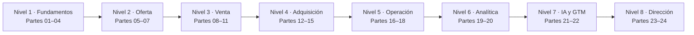

<div align="center">

# 📈 Marketing, Sales & Growth Evolution Program

## **336 clases · 24 partes · 1.256 horas · de fundamentos comerciales a dirección de ingresos**

**El programa de marketing, ventas y crecimiento más completo en español — desde investigación de mercado, posicionamiento y pricing hasta venta consultiva, RevOps, growth, analítica, IA comercial y el operating system de un CRO.**

[](https://github.com/vladimiracunadev-create/marketing-sales-growth-evolution-program/actions/workflows/ci.yml)
[](https://vladimiracunadev-create.github.io/marketing-sales-growth-evolution-program/)
[](https://github.com/vladimiracunadev-create/marketing-sales-growth-evolution-program/actions/workflows/security.yml)
[](https://github.com/vladimiracunadev-create/marketing-sales-growth-evolution-program/actions/workflows/codeql.yml)

[](CHANGELOG.md)
[](curriculum/README.md)
[](MANIFEST.md)
[](rutas/README.md)
[](LICENSE)

[🌐 Portal](https://vladimiracunadev-create.github.io/marketing-sales-growth-evolution-program/) ·
[📚 Índice de las 336 clases](curriculum/README.md) ·
[🧭 Rutas por rol](rutas/README.md) ·
[📅 Syllabus](SYLLABUS.md) ·
[📖 Glosario (1.344 términos)](docs/GLOSARIO.md) ·
[📐 Métricas (1.008 fichas)](docs/FORMULAS-Y-METRICAS.md) ·
[🗺️ Roadmap](ROADMAP.md) ·
[🤝 Contribuir](CONTRIBUTING.md) ·
[🔐 Seguridad](SECURITY.md)

**Cobertura por nivel:**
[Fundamentos](curriculum/part-01-marketing-y-ventas-fundamentos-del-sistema-comercial/README.md) ·
[Oferta y pricing](curriculum/part-07-pricing-y-monetizacion/README.md) ·
[Venta B2B](curriculum/part-09-venta-consultiva-y-b2b-compleja/README.md) ·
[Adquisición](curriculum/part-12-marketing-digital-y-adquisicion/README.md) ·
[RevOps](curriculum/part-17-marketing-automation-y-revenue-operations/README.md) ·
[Growth](curriculum/part-19-growth-marketing-y-growth-engineering/README.md) ·
[IA comercial](curriculum/part-21-ia-aplicada-a-marketing-ventas-y-servicio/README.md) ·
[Dirección](curriculum/part-23-direccion-comercial-cmo-vp-sales-y-cro/README.md)

</div>

---

> [!WARNING]
> **Cumplimiento y datos personales.** Los ejercicios usan **datos sintéticos** y no requieren clientes ni
> presupuesto real. Antes de aplicar cualquier contenido a una operación real, verifica la norma vigente en
> su fuente oficial: la Ley 19.496 del consumidor, el reglamento de comercio electrónico y la Ley 21.719 de
> datos personales imponen requisitos de diseño sobre campañas, listas, propuestas y automatizaciones. Este
> programa es formación aplicada, **no asesoría legal, tributaria ni financiera**.

## 🎯 Qué es esto

Un currículo **secuencial, basado en libros y orientado a evidencia**: 336 clases agrupadas en 24 partes,
desde el diagnóstico del motor de ingresos hasta la dirección de la función comercial completa. Cada clase
es un documento de 3.000 a 4.100 palabras que incluye:

- 🎯 **Propósito** anclado a una decisión concreta, no a una definición.
- 🧩 **Conceptos con definición operacional**: dos personas independientes deben clasificar el mismo caso igual.
- 📐 **Fichas de medición**: numerador, denominador, ventana, fuente y lectura prohibida.
- 🧠 **Modelo mental** con el método por pasos y su **frontera de aplicación** explícita.
- 📚 **Lectura comparada** de dos a cuatro obras, con el lente que aporta cada una.
- 🧮 **Ejemplo trabajado** sobre el caso persistente, con números concretos.
- 🏢 **Caso ejecutivo** que exige dos alternativas defendibles y una condición de revisión.
- ⚠️ **Errores frecuentes** (síntoma → causa → corrección).
- 🇨🇱 **Contexto normativo chileno** traducido a requisitos de diseño.
- ✅ **Rúbrica publicada antes del trabajo** y 📗 **fuentes verificables**.

## ✅ Estado verificable

| Superficie | Cobertura |
|---|---|
| 📚 Currículo | 336/336 clases en 24 partes · 1.290.000 palabras · estándar `clase-profunda-v3` |
| 🧩 Conceptos | 1.344 términos con definición operacional, todos en el [glosario](docs/GLOSARIO.md) |
| 📐 Medición | 1.008 señales con ficha completa en [fórmulas y métricas](docs/FORMULAS-Y-METRICAS.md) |
| 📖 Bibliografía | 96 obras con el lente que aporta cada una y trazabilidad por clase |
| 🧪 Práctica | 48 laboratorios con rúbrica de 100 puntos y escenario adverso obligatorio |
| 🏆 Evaluación | 24 evaluaciones de cuatro bloques ponderados + 12 proyectos + Capstone eliminatorio |
| 🧭 Rutas por rol | 17 guías de carrera con día a día, artefactos, progresión y rangos |
| 🖥️ Portal | 613 páginas HTML autocontenidas, buscador, modo oscuro y hoja de impresión |
| 🇨🇱 Regulación | Consumo, comercio electrónico, datos personales, marcas, tributación y libre competencia |
| 🔧 Calidad | 46 pruebas, 3 validadores, CI multi-OS/Python, CodeQL y verificación de reproducibilidad |

## 🗺️ El recorrido en 8 niveles



| Nivel | Partes | Competencia que construye |
|---|---:|---|
| 1️⃣ Fundamentos | 01–04 | Sistema comercial, cliente, investigación y posicionamiento |
| 2️⃣ Oferta comercial | 05–07 | Propuesta de valor, marca y arquitectura de monetización |
| 3️⃣ Venta | 08–11 | Proceso reproducible, venta consultiva, negociación y prospección |
| 4️⃣ Adquisición | 12–15 | Digital, contenido, medios pagados y comercio electrónico |
| 5️⃣ Operación de ingresos | 16–18 | CRM, RevOps y sistema de retención |
| 6️⃣ Crecimiento y analítica | 19–20 | Experimentación, cohortes, atribución e incrementalidad |
| 7️⃣ IA y expansión | 21–22 | IA con guardarraíles y go-to-market |
| 8️⃣ Dirección y Capstone | 23–24 | Operating system del CRO y empresa integrada |

## 🗂️ Las 24 partes

Cada parte tiene su **propio README** con la pregunta rectora, el caso, las competencias y sus 14 clases.

| # | Parte | Clases | Artefacto de portafolio | README |
|---:|---|---:|---|---|
| 01 | Marketing y ventas: fundamentos del sistema comercial | 14 | Mapa del motor de ingresos | [📘 leer](curriculum/part-01-marketing-y-ventas-fundamentos-del-sistema-comercial/README.md) |
| 02 | Cliente y comportamiento del consumidor | 14 | Expediente de cliente accionable | [📘 leer](curriculum/part-02-cliente-y-comportamiento-del-consumidor/README.md) |
| 03 | Investigación de mercados e inteligencia competitiva | 14 | Informe de oportunidad de mercado | [📘 leer](curriculum/part-03-investigacion-de-mercados-e-inteligencia-competitiva/README.md) |
| 04 | Segmentación, targeting y posicionamiento | 14 | Arquitectura STP probada | [📘 leer](curriculum/part-04-segmentacion-targeting-y-posicionamiento/README.md) |
| 05 | Producto, oferta y propuesta de valor | 14 | Oferta lista para vender | [📘 leer](curriculum/part-05-producto-oferta-y-propuesta-de-valor/README.md) |
| 06 | Marca, branding y comunicación estratégica | 14 | Brand book mínimo viable | [📘 leer](curriculum/part-06-marca-branding-y-comunicacion-estrategica/README.md) |
| 07 | Pricing y monetización | 14 | Arquitectura de monetización | [📘 leer](curriculum/part-07-pricing-y-monetizacion/README.md) |
| 08 | Fundamentos profesionales de ventas | 14 | Playbook comercial | [📘 leer](curriculum/part-08-fundamentos-profesionales-de-ventas/README.md) |
| 09 | Venta consultiva y B2B compleja | 14 | Deal review con mapa de cuenta | [📘 leer](curriculum/part-09-venta-consultiva-y-b2b-compleja/README.md) |
| 10 | Negociación comercial | 14 | Carpeta de negociación | [📘 leer](curriculum/part-10-negociacion-comercial/README.md) |
| 11 | Prospección y generación de demanda | 14 | Sistema de prospección repetible | [📘 leer](curriculum/part-11-prospeccion-y-generacion-de-demanda/README.md) |
| 12 | Marketing digital y adquisición | 14 | Plan de adquisición y auditoría | [📘 leer](curriculum/part-12-marketing-digital-y-adquisicion/README.md) |
| 13 | Contenido, copywriting y comunicación persuasiva | 14 | Sistema editorial completo | [📘 leer](curriculum/part-13-contenido-copywriting-y-comunicacion-persuasiva/README.md) |
| 14 | Publicidad y performance marketing | 14 | Plan de performance con umbrales | [📘 leer](curriculum/part-14-publicidad-y-performance-marketing/README.md) |
| 15 | E-commerce y marketplaces | 14 | Simulación de tienda rentable | [📘 leer](curriculum/part-15-e-commerce-y-marketplaces/README.md) |
| 16 | CRM, pipeline y sales operations | 14 | Diseño de sales operations | [📘 leer](curriculum/part-16-crm-pipeline-y-sales-operations/README.md) |
| 17 | Marketing automation y revenue operations | 14 | Operating model de RevOps | [📘 leer](curriculum/part-17-marketing-automation-y-revenue-operations/README.md) |
| 18 | Customer experience, success y fidelización | 14 | Sistema de retención y expansión | [📘 leer](curriculum/part-18-customer-experience-success-y-fidelizacion/README.md) |
| 19 | Growth marketing y growth engineering | 14 | Growth model completo | [📘 leer](curriculum/part-19-growth-marketing-y-growth-engineering/README.md) |
| 20 | Analítica comercial y marketing science | 14 | Caso analítico integral | [📘 leer](curriculum/part-20-analitica-comercial-y-marketing-science/README.md) |
| 21 | IA aplicada a marketing, ventas y servicio | 14 | Operating model humano-IA | [📘 leer](curriculum/part-21-ia-aplicada-a-marketing-ventas-y-servicio/README.md) |
| 22 | Go-to-market, canales y expansión | 14 | Plan GTM completo | [📘 leer](curriculum/part-22-go-to-market-canales-y-expansion/README.md) |
| 23 | Dirección comercial: CMO, VP Sales y CRO | 14 | Operating system del CRO | [📘 leer](curriculum/part-23-direccion-comercial-cmo-vp-sales-y-cro/README.md) |
| 24 | Empresa real, regulación y Capstone | 14 | Capstone con defensa ejecutiva | [📘 leer](curriculum/part-24-empresa-real-regulacion-y-capstone/README.md) |

➡️ **[Ver el índice completo del currículo](curriculum/README.md)**

## 🏢 El caso persistente

Todo el programa trabaja sobre **Ruta Andina SpA**, una empresa chilena que vende una plataforma de
agendamiento, pagos y CRM ligero a pymes de servicios. Tiene tres líneas de ingreso —suscripción, comercio
electrónico y contratos con el sector público—, lo que permite recorrer venta B2B recurrente, marketplace y
venta al Estado sin cambiar de contexto.

Su estado inicial deja el problema a la vista:

| Indicador | Valor | Por qué importa |
|---|---:|---|
| Cuentas activas | 240 | Base pequeña, cada baja pesa |
| Churn mensual de ingreso | 5,1 % | Mayor que el de cuentas: se van las grandes |
| Periodo de recuperación del CAC | 14 meses | **Mayor que la vida media del cliente** |
| Vida media del cliente | 11 meses | Cada cliente nuevo destruye caja antes de aportar |
| Activación a 14 días | 22 % | El 61 % de las bajas nunca completó la carga inicial |

Las decisiones de cada parte condicionan las siguientes; el estado acumulado vive en
[`simulations/state/`](simulations/state/).

## 🧪 Laboratorios y proyectos

| 🧭 Recorrido práctico | Qué produce |
|---|---|
| 🧪 **48 laboratorios** | Memo de decisión, cálculo, fichas de métricas y escenario adverso |
| 🏆 **24 evaluaciones** | Cuatro bloques ponderados: concepto, caso, método y fuentes |
| 📁 **24 casos extendidos** | Con complicación a mitad de sesión que obliga a recalcular |
| 🔗 **12 proyectos integradores** | Conectan dos partes y exigen resolver su contradicción |
| 🎓 **1 Capstone** | Empresa completa con cumplimiento normativo **eliminatorio** |

[Laboratorios](labs/) · [Evaluaciones](assessments/) · [Casos](cases/) · [Proyectos](projects/) ·
[Capstone](capstone/README.md)

## 🖥️ Portal de aprendizaje

El portal se genera desde el mismo Markdown del repositorio, así que no puede desincronizarse. Es
**autocontenido**: sin recursos externos, sin rastreadores y sin cuentas.

- 🔎 **Buscador** por título y por conceptos, operable por teclado.
- 🌗 **Tema claro, oscuro y según el sistema.**
- 🖨️ **Hoja de estilo de impresión** para estudiar en papel.
- 📊 **Panel de progreso** con clases, laboratorios y evaluaciones, exportable e importable.

[Abrir el portal](https://vladimiracunadev-create.github.io/marketing-sales-growth-evolution-program/) ·
[Abrir el currículo](https://vladimiracunadev-create.github.io/marketing-sales-growth-evolution-program/curriculum/index.html) ·
[Abrir el panel de progreso](https://vladimiracunadev-create.github.io/marketing-sales-growth-evolution-program/apps/learning-dashboard/index.html)

## 🧭 Rutas por rol

**17 guías de carrera completas.** Cada una explica qué es el puesto, cómo es un día real, qué hay que
saber, qué partes del programa lo preparan, qué artefactos lo acreditan, cómo progresa y qué mitos lo
rodean.

| Rol | Núcleo recomendado | Artefacto faro |
|---|---|---|
| 📊 **[Analista de marketing](rutas/analista-de-marketing.md)** | 01, 20, 16, 18 | Árbol de métricas y caso analítico |
| 🎯 **[Marketing manager](rutas/marketing-manager.md)** | 01, 02, 04, 06, 12 | Plan de adquisición con economía |
| 🧩 **[Product marketing](rutas/product-marketing.md)** | 02, 03, 04, 05 | Oferta con prueba de traspaso |
| 🚀 **[Growth manager](rutas/growth-manager.md)** | 18, 19, 20, 12 | Growth model con experimentos |
| 📞 **[SDR / BDR](rutas/sdr-bdr.md)** | 01, 02, 11, 08 | Sistema de prospección repetible |
| 🤝 **[Ejecutivo comercial](rutas/ejecutivo-comercial.md)** | 08, 09, 10, 16 | Deal review y carpeta de negociación |
| 🔁 **[Customer Success](rutas/customer-success.md)** | 02, 05, 18, 20 | Sistema de retención con health score |
| ⚙️ **[RevOps](rutas/revops.md)** | 16, 17, 20, 18 | Operating model con cifra única |
| 📈 **[Performance marketer](rutas/performance-marketer.md)** | 12, 14, 13, 20 | Plan con umbrales e incrementalidad |
| ✍️ **[Content manager](rutas/content-manager.md)** | 02, 04, 13, 12 | Sistema editorial con control |
| 🛒 **[E-commerce manager](rutas/ecommerce-manager.md)** | 15, 12, 07, 20 | Modelo económico de tienda |
| 🎨 **[Brand manager](rutas/brand-manager.md)** | 04, 06, 13, 20 | Brand book con medición |
| 🗺️ **[Head of GTM](rutas/head-of-gtm.md)** | 04, 05, 22, 23 | Plan GTM con capacidad declarada |
| 🏛️ **[CMO](rutas/cmo.md)** | 04, 06, 20, 23 | Presupuesto con supuestos |
| 🏅 **[VP de ventas](rutas/vp-sales.md)** | 08, 09, 16, 23 | Cuotas, territorios y forecast |
| 👑 **[CRO](rutas/cro.md)** | 16, 17, 18, 23, 24 | Operating system del CRO |
| 🚩 **[Founder](rutas/founder.md)** | 01–08, 11, 12, 24 | Capstone sobre empresa propia |

➡️ **[Ver todas las rutas con su guía completa](rutas/README.md)**

## 🏆 Evaluación verificable

La evaluación se apoya en **evidencia y defensa**, no en marcar temas como leídos.

| Dimensión | Evidencia mínima |
|---|---|
| 🔍 Diagnóstico | Problema formulado antes que la herramienta, con costo de no actuar |
| 📐 Medición | Ficha operacional completa, incluida la lectura prohibida |
| ⚖️ Decisión | Dos alternativas defendibles con costo de oportunidad y reversibilidad |
| 📚 Fuentes | Dos lecturas realmente usadas, con la tensión entre ellas explicitada |
| 🇨🇱 Cumplimiento | Obligación normativa traducida a requisito de diseño |
| 🗣️ Comunicación | Un tercero puede auditar el razonamiento sin el autor presente |

[Rúbricas y criterios](docs/EVALUACION-Y-RUBRICAS.md) ·
[Estándar de evidencia](docs/ESTANDAR-DE-EVIDENCIA.md) ·
[Estándar pedagógico](docs/ESTANDAR-PEDAGOGICO.md)

## 🚀 Cómo usar el programa

1. **Elige tu recorrido.** Empieza por la [ruta de aprendizaje](docs/RUTA-DE-APRENDIZAJE.md) o por una
   [ruta profesional](rutas/README.md) si ya sabes a qué puesto apuntas.
2. **Responde antes de leer.** Cada clase abre con una pregunta rectora: contéstala por escrito antes de
   seguir. La recuperación previa retiene más que cualquier resumen.
3. **No saltes el bloque de medición.** Construir la ficha de la métrica principal es donde más se aprende
   y lo primero que se omite.
4. **Produce dos alternativas.** Un entregable con una sola opción no cumple el estándar, aunque la opción
   sea correcta.
5. **Conserva la evidencia** en `evidence/` con la convención del
   [estándar de evidencia](docs/ESTANDAR-DE-EVIDENCIA.md).
6. **Aprueba antes de avanzar:** 80/100 en la evaluación de la parte y ningún bloque bajo 60 %.
7. **Cierra con el Capstone** y defiéndelo: el bloque de cumplimiento normativo es eliminatorio.

**Inicio local:**

```bash
git clone https://github.com/vladimiracunadev-create/marketing-sales-growth-evolution-program.git
cd marketing-sales-growth-evolution-program

python tools/validate_repository.py    # estructura, profundidad, idioma y bibliografía
python tools/build_site.py             # genera el portal en site/
python -m http.server 8000 --directory site
```

**Regenerar el contenido desde la especificación:**

```bash
python tools/build_curriculum.py       # 336 clases + índices + curriculum.json
python tools/build_practica.py         # 48 labs, 24 evaluaciones, 24 casos, 12 proyectos
python tools/build_rutas.py            # 17 rutas profesionales
python tools/build_docs.py             # glosario, métricas, bibliografía, syllabus, manifiesto
python tools/build_status.py           # estado verificable del repositorio
```

Los generadores usan **sólo la biblioteca estándar de Python**: construir y validar el material no exige
instalar nada.

## ✅ Calidad y CI

El repositorio no se publica a ciegas. Cada `push` y cada pull request pasan por integración continua que
valida estructura, profundidad, idioma, enlaces y reproducibilidad. **Nada llega a `main` en rojo**, y el
portal se verifica **después** de publicarse.

| ⚙️ Workflow | Qué cubre |
|---|---|
| 🧪 [ci.yml](.github/workflows/ci.yml) | Validadores, pruebas y compatibilidad en Linux, macOS y Windows con Python 3.9–3.13 |
| 🔁 [ci.yml · reproducibilidad](.github/workflows/ci.yml) | Regenera el contenido y falla si difiere de lo confirmado |
| 🚀 [pages.yml](.github/workflows/pages.yml) | Construye, valida y publica el portal — y comprueba el sitio **ya desplegado** |
| 🔒 [security.yml](.github/workflows/security.yml) | Dependencias, secretos, datos sintéticos y ausencia de recursos externos |
| 🔎 [codeql.yml](.github/workflows/codeql.yml) | Análisis estático de seguridad sobre las herramientas |

Los mismos validadores corren en local antes de subir:

```bash
python tools/validate_repository.py   # 336 clases, secciones obligatorias e idioma
python tools/validate_depth.py        # profundidad mínima por clase, lab, evaluación y caso
python tools/check_links.py           # enlaces internos
python tools/validate_site.py         # artefacto del portal completo
python -m pytest -q                   # 46 pruebas
```

## 👩‍🏫 Para instructores

El programa está listo para migrar a capacitación **sin reescribir contenido**: cada clase trae agenda por
tramos de 150 minutos, rúbrica publicada y caso con complicación. Hay formatos de 45, 90 y 150 minutos,
taller intensivo de dos días y programa completo de doce meses.

[📐 Metodología](docs/METODOLOGIA.md) ·
[👩‍🏫 Guía docente](docs/GUIA-DOCENTE.md) ·
[🎓 Plan de capacitación y migración a LMS](docs/PLAN-DE-CAPACITACION.md) ·
[♿ Accesibilidad](docs/ACCESIBILIDAD.md)

<details>
<summary><b>📚 Base bibliográfica — las 96 obras que ordenan cada parte</b></summary>

<br>

El programa usa libros para ordenar conceptos y profundidad; **toda la redacción es original y no reproduce
sus textos**. Cada obra declara el *lente* que aporta, y cada clase indica de dos a cuatro.

| Área | Obras guía |
|---|---|
| Marketing y estrategia | *Marketing Management* · *How Brands Grow* · *Positioning* · *Good Strategy / Bad Strategy* · *Competitive Strategy* |
| Cliente e investigación | *Competing Against Luck* · *The Mom Test* · *Marketing Research* · *Interviewing Users* · *How to Measure Anything* |
| Comportamiento y decisión | *Thinking, Fast and Slow* · *Influence* · *Nudge* · *Predictably Irrational* |
| Marca y comunicación | *Building Strong Brands* · *Strategic Brand Management* · *Made to Stick* · *The Long and the Short of It* |
| Precio y monetización | *The Strategy and Tactics of Pricing* · *Monetizing Innovation* · *Confessions of the Pricing Man* |
| Ventas y negociación | *SPIN Selling* · *The Challenger Sale* · *Gap Selling* · *Getting to Yes* · *Negotiation Genius* |
| Digital y conversión | *Digital Marketing* · *Web Analytics 2.0* · *Don't Make Me Think* · *The Art of SEO* |
| Growth y experimentación | *Hacking Growth* · *Lean Analytics* · *Trustworthy Online Controlled Experiments* · *Product-Led Growth* |
| Retención y éxito de cliente | *Customer Success* · *Winning on Purpose* · *Customer Centricity* · *The Effortless Experience* |
| Dirección y operaciones | *High Output Management* · *Measure What Matters* · *Revenue Operations* · *The Balanced Scorecard* |
| IA, datos y ética | *Data Science for Business* · *Weapons of Math Destruction* · *NIST AI RMF* · *Understanding Variation* |
| Pedagogía del programa | *How Learning Works* · *Make It Stick* · *Understanding by Design* · *Peak* · *The Case Study Handbook* |

[Bibliografía completa con el lente de cada obra y su uso por clase](docs/BIBLIOGRAFIA.md)

</details>

## 🎯 Qué es y qué no es este programa

<table>
<tr>
<td valign="top" width="50%">

### ✅ Lo que sí es

- 📚 un currículo **secuencial y completo** de 336 clases con 24 evaluaciones y Capstone;
- 📐 un método donde **toda afirmación termina en algo observable** y toda métrica declara su ficha;
- 🧪 práctica **reproducible y sin costo**: datos sintéticos, sin cuentas ni presupuesto real;
- 🇨🇱 cumplimiento chileno tratado como **restricción de diseño**, no como advertencia final;
- 🌐 material **abierto y offline-friendly** (portal HTML + panel de progreso), en español.

</td>
<td valign="top" width="50%">

### ❌ Lo que no es

- 🚫 una colección de tips, plantillas sueltas o listas de herramientas;
- 🚫 un curso de una sola disciplina: cubre marketing, ventas, retención y dirección;
- 🚫 una promesa de resultados de mercado a partir de datos simulados;
- 🚫 asesoría legal, tributaria ni financiera;
- 🚫 una certificación oficial ni una garantía laboral.

</td>
</tr>
</table>

## ⚖️ Límites honestos

- El programa construye **criterio y portafolio**; no concede certificaciones ni garantiza empleo.
- Los datos del caso son **sintéticos**: enseñan a razonar, no acreditan resultados reales de mercado.
- La normativa **cambia**: el mapa regulatorio tiene fecha de revisión y la fuente oficial siempre manda.
- Un plan coherente sobre supuestos falsos sigue siendo un plan equivocado; la validación es tuya.
- Ningún método elimina la incertidumbre comercial: la hace **visible y proporcional a la evidencia**.
- La profundidad real exige producir evidencia, equivocarse, medir y **defender** cada decisión.

## 💡 Idea fuerza

> El marketing y las ventas no se dominan acumulando tácticas. Se dominan conectando **decisiones con
> evidencia**, evidencia con **métricas bien definidas** y métricas con **consecuencias** que alguien está
> dispuesto a defender ante un comité.

## 🔍 Programas hermanos

[☁️ Multi-Cloud Engineering](https://github.com/vladimiracunadev-create/multi-cloud-engineering-program) ·
[🛡️ Ciberseguridad Moderna](https://github.com/vladimiracunadev-create/modern-cybersecurity-program) ·
[🧠 AI Evolution](https://github.com/vladimiracunadev-create/artificial-intelligence-evolution-program) ·
[🐍 Python Data Science](https://github.com/vladimiracunadev-create/python-data-science-program) ·
[⛓️ Blockchain Learning Path](https://github.com/vladimiracunadev-create/blockchain-learning-path) ·
[🌐 Polyglot Programming](https://github.com/vladimiracunadev-create/polyglot-programming-labs)

## 📄 Licencia

[MIT](LICENSE) para el código y el contenido original del repositorio. Las obras citadas, marcas, normas y
frameworks pertenecen a sus respectivos titulares: el programa los cita y **no los redistribuye**.

---

<div align="center">

**Diagnostica · decide · mide · defiende · corrige**

[⬆️ Empezar por el índice de las 336 clases](curriculum/README.md)

<br>

**¿Te resulta útil? ⭐ Dale una estrella al repo.**

[](https://github.com/vladimiracunadev-create/marketing-sales-growth-evolution-program/stargazers)
[](https://github.com/vladimiracunadev-create/marketing-sales-growth-evolution-program/network/members)
[](https://github.com/vladimiracunadev-create)

Hecho con 🧠 y ☕ por [Vladimir Acuña](https://github.com/vladimiracunadev-create)

</div>
