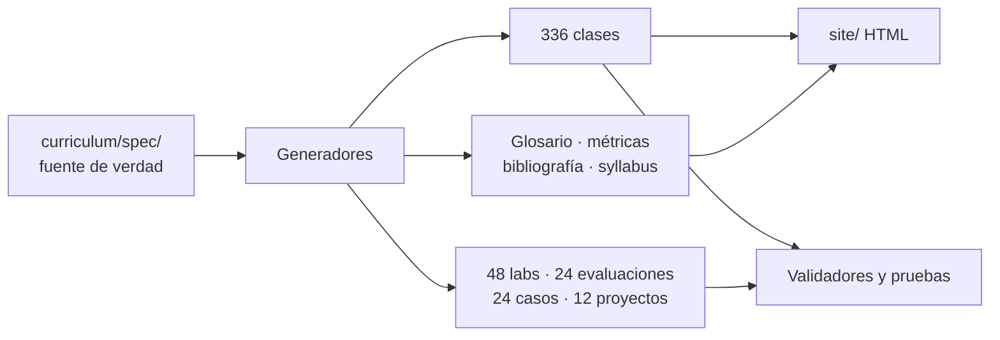

# Marketing, Sales & Growth Evolution Program

> De fundamentos comerciales a dirección de ingresos: 24 partes, 336 clases y un caso persistente donde cada
> decisión condiciona la siguiente. En español, con bibliografía verificable y contexto normativo chileno.


---

## Qué es

Un **programa educativo completo y acumulativo** sobre marketing, ventas y crecimiento. No es una colección
de tips ni un glosario ampliado: cada clase toma un problema comercial, entrega definiciones operacionales,
un método con su frontera de aplicación, una ficha de medición, un caso con restricciones reales y una
rúbrica publicada antes del trabajo.

La diferencia con el material habitual del rubro está en tres reglas que se cumplen en las 336 clases:

1. **Toda afirmación termina en algo observable.** 1.344 conceptos con definición operacional, no con
   descripción poética.
2. **Toda métrica declara su ficha.** 1.008 señales con numerador, denominador y ventana temporal.
3. **Todo método declara su límite.** Cada clase indica cuándo la herramienta enseñada deja de funcionar.

## Qué contiene

| Elemento | Cantidad |
|---|---:|
| Partes del currículo | 24 |
| Clases (3.000–4.100 palabras cada una) | 336 |
| Palabras de contenido curricular | ~1.290.000 |
| Conceptos con definición operacional | 1.344 |
| Señales y métricas definidas | 1.008 |
| Laboratorios con rúbrica | 48 |
| Evaluaciones de parte | 24 |
| Casos extendidos con complicación | 24 |
| Proyectos integradores | 12 |
| Capstone con cumplimiento eliminatorio | 1 |
| Obras de referencia citadas | 96 |
| Conjuntos de datos sintéticos | 5 |
| Notebooks de analítica | 8 |

Verificable con `python tools/build_docs.py` → [`MANIFEST.md`](MANIFEST.md).

## Empezar

```bash
git clone https://github.com/vladimiracunadev-create/marketing-sales-growth-evolution-program.git
cd marketing-sales-growth-evolution-program

python tools/validate_repository.py    # verifica la integridad del material
python tools/build_site.py             # genera el sitio HTML en site/
```

Después:

1. Lee la [ruta de aprendizaje](docs/RUTA-DE-APRENDIZAJE.md) y elige tu recorrido.
2. Empieza por [la parte 01](curriculum/part-01-marketing-y-ventas-fundamentos-del-sistema-comercial/README.md).
3. Guarda tu evidencia siguiendo el [estándar de evidencia](docs/ESTANDAR-DE-EVIDENCIA.md).

No se requiere instalar dependencias para estudiar ni para construir el material: los generadores usan sólo
la biblioteca estándar de Python.

## El caso persistente

Todo el programa trabaja sobre **Ruta Andina SpA**: una empresa chilena que vende una plataforma de
agendamiento, pagos y CRM ligero a pymes de servicios, con tres líneas de ingreso —suscripción, comercio
electrónico y contratos con el sector público—. La elección permite recorrer venta B2B recurrente, comercio
digital, marketplace y venta al Estado sin cambiar de contexto.

Su estado inicial: 18 meses de operación, 240 cuentas activas, churn mensual de 3,4 %, un CRM con datos
incompletos y un directorio que pide duplicar ingresos en 18 meses sin duplicar el gasto comercial.

Las decisiones de cada parte condicionan las siguientes. El estado acumulado vive en
[`simulations/state/`](simulations/state/).

## Ruta del programa

| Nivel | Partes | Resultado |
|---|---|---|
| **Fundamentos** | [01](curriculum/part-01-marketing-y-ventas-fundamentos-del-sistema-comercial/README.md)–[04](curriculum/part-04-segmentacion-targeting-y-posicionamiento/README.md) | Mercado, cliente, investigación y posicionamiento |
| **Oferta comercial** | [05](curriculum/part-05-producto-oferta-y-propuesta-de-valor/README.md)–[07](curriculum/part-07-pricing-y-monetizacion/README.md) | Producto, marca y monetización |
| **Venta** | [08](curriculum/part-08-fundamentos-profesionales-de-ventas/README.md)–[11](curriculum/part-11-prospeccion-y-generacion-de-demanda/README.md) | Proceso comercial, B2B, negociación y prospección |
| **Adquisición** | [12](curriculum/part-12-marketing-digital-y-adquisicion/README.md)–[15](curriculum/part-15-e-commerce-y-marketplaces/README.md) | Digital, contenido, medios pagados y e-commerce |
| **Operación de ingresos** | [16](curriculum/part-16-crm-pipeline-y-sales-operations/README.md)–[18](curriculum/part-18-customer-experience-success-y-fidelizacion/README.md) | CRM, RevOps y Customer Success |
| **Crecimiento y analítica** | [19](curriculum/part-19-growth-marketing-y-growth-engineering/README.md)–[20](curriculum/part-20-analitica-comercial-y-marketing-science/README.md) | Growth y marketing science |
| **IA y expansión** | [21](curriculum/part-21-ia-aplicada-a-marketing-ventas-y-servicio/README.md)–[22](curriculum/part-22-go-to-market-canales-y-expansion/README.md) | IA comercial y go-to-market |
| **Dirección y Capstone** | [23](curriculum/part-23-direccion-comercial-cmo-vp-sales-y-cro/README.md)–[24](curriculum/part-24-empresa-real-regulacion-y-capstone/README.md) | Operating system del CRO y empresa integrada |

Detalle completo en el [mapa del currículo](docs/MAPA-DEL-CURRICULO.md).

## Cómo está construido



El Markdown publicado es una **salida**, no la fuente. La sustancia pedagógica vive en
[`curriculum/spec/`](curriculum/spec/) y se genera con `tools/`. Esa decisión evita la deriva que degrada los
repositorios educativos grandes: 336 clases editadas a mano terminan con estructuras distintas y métricas
inconsistentes.

Detalle en [arquitectura del programa](docs/ARQUITECTURA-DEL-PROGRAMA.md).

## Estructura

```text
curriculum/     24 partes, 336 clases y la especificación fuente
labs/           48 laboratorios con rúbrica de 100 puntos
assessments/    24 evaluaciones de cuatro bloques ponderados
cases/          24 casos extendidos con complicación a mitad de sesión
projects/       12 proyectos integradores acumulativos
capstone/       operación comercial completa con cumplimiento eliminatorio
datasets/       5 conjuntos sintéticos reproducibles
notebooks/      8 notebooks de analítica comercial
templates/      plantillas de artefactos por materia
simulations/    estado persistente de la empresa simulada
ai/             prompts, especificaciones de agentes y guardarraíles
docs/           metodología, estándares, glosario, regulación y enseñanza
tools/          generadores, validadores y constructor del sitio
tests/          pruebas de estructura, profundidad e idioma
apps/           panel de seguimiento local sin dependencias
site/           sitio HTML autocontenido para lectura y capacitación
```

## Para instructores

El programa está listo para migrar a capacitación sin reescribir contenido: cada clase trae agenda por
tramos, rúbrica publicada y caso con complicación. Formatos de 45, 90 y 150 minutos, taller intensivo de dos
días y programa completo de doce meses.

Ver [plan de capacitación](docs/PLAN-DE-CAPACITACION.md) y [guía docente](docs/GUIA-DOCENTE.md).

El contenido en HTML se genera con `python tools/build_site.py` y `curriculum/curriculum.json` entrega el
árbol completo para importar a un LMS.

## Contexto chileno

El cumplimiento normativo se trata como **restricción de diseño**, no como advertencia final. Cada clase
incluye su sección de contexto chileno y el Capstone tiene un bloque eliminatorio de cumplimiento.

Cubre: Ley 19.496 y comercio electrónico, Ley 21.719 de datos personales, propiedad industrial ante INAPI,
obligaciones tributarias de la venta y reglas de libre competencia.

Ver [mapa regulatorio](docs/MAPA-REGULATORIO-CHILE.md) y [fuentes oficiales](docs/FUENTES-OFICIALES.md).

> **La fuente oficial manda sobre el material pedagógico.** Este programa es formación aplicada, no asesoría
> legal, tributaria ni financiera.

## Verificación

```bash
python tools/validate_repository.py    # estructura, secciones obligatorias e idioma
python tools/validate_depth.py         # profundidad mínima por clase
python tools/check_links.py            # enlaces internos
python -m pytest -q                    # suite completa
```

El [manifiesto](MANIFEST.md) cuenta archivos reales; no declara cifras a mano.

## Qué este programa no hace

- **No certifica ni garantiza empleo.** Acredita evidencia de trabajo: los artefactos son la credencial.
- **No entrega asesoría legal, tributaria ni financiera.**
- **No promete resultados de mercado.** Los datos del caso son sintéticos y así se declaran.
- **No redistribuye obras protegidas.** Cita, contrasta y enseña a leer de forma selectiva.

## Documentación

| Documento | Contenido |
|---|---|
| [Syllabus](SYLLABUS.md) | Programa completo en una página |
| [Ruta de aprendizaje](docs/RUTA-DE-APRENDIZAJE.md) | Recorridos según objetivo |
| [Metodología](docs/METODOLOGIA.md) | Por qué está construido así |
| [Glosario](docs/GLOSARIO.md) | 1.344 términos operacionales |
| [Fórmulas y métricas](docs/FORMULAS-Y-METRICAS.md) | 1.008 señales con su ficha |
| [Bibliografía](docs/BIBLIOGRAFIA.md) | 96 obras con su lente |
| [Rutas profesionales](docs/RUTAS-PROFESIONALES.md) | Roles y artefactos que los acreditan |
| [Documentación completa](docs/README.md) | Índice de todos los documentos |

## Licencia

Contenido original y código: [MIT](LICENSE). Las obras citadas, marcas, normas y frameworks pertenecen a sus
respectivos titulares; el repositorio los cita y no los redistribuye.

## Estado

**v2.0.0** — currículo profundo completo en español, capa de práctica regenerada, documentación y sitio HTML.
Ver [STATUS.md](STATUS.md), [CHANGELOG.md](CHANGELOG.md) y [ROADMAP.md](ROADMAP.md).
