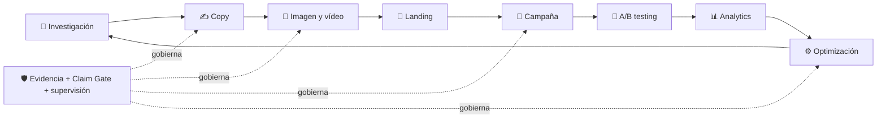
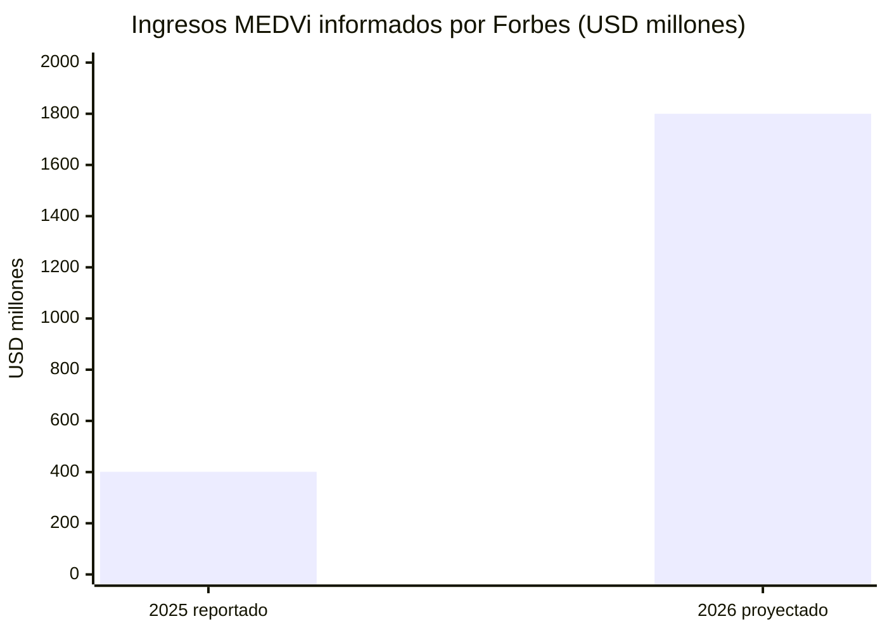
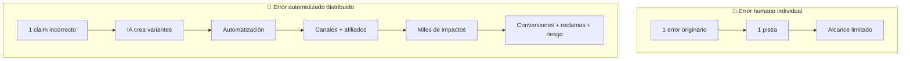
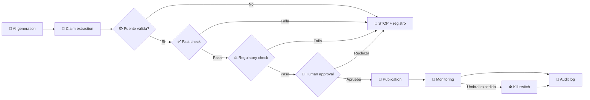
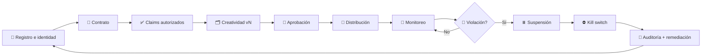

# Caso 24 — Empresa real, regulación y Capstone

## Contexto

Ruta Andina SpA — Empresa chilena que vende una plataforma de agendamiento, pagos y CRM ligero para pymes de servicios (peluquerías, talleres, centros médicos pequeños, estudios contables). Tiene tres líneas de ingreso: suscripción SaaS (CLP 39.000 a CLP 199.000 mensuales por local), venta de hardware complementario por e-commerce y marketplace, y contratos anuales con municipios y corporaciones para digitalizar atención de público.

**Estado de la empresa.** 18 meses de operación, 240 cuentas activas, ARR aproximado de CLP 610 millones, churn mensual de 3,4 %, equipo comercial de 6 personas, CAC mixto de CLP 310.000 y un CRM con datos incompletos. El directorio pide duplicar ingresos en 18 meses sin duplicar el gasto comercial.

**Restricciones.** Presupuesto de marketing y ventas acotado, un solo analista de datos compartido, obligación de cumplir la Ley 19.496 del consumidor y de prepararse para la Ley 21.719 de datos personales, y un competidor regional con más capital.

## Situación

El Capstone exige presentar la operación completa de Ruta Andina —o de una empresa propia— ante un panel que revisará números, evidencia y cumplimiento.

El equipo tiene tres semanas para presentar una recomendación al comité. Existen posiciones encontradas dentro de la empresa y la información disponible es incompleta en varios frentes.

## Datos disponibles

| Fuente | Contenido | Limitación conocida |
|---|---|---|
| `datasets/leads.csv` | Origen, estado y fecha de leads | Registro incompleto antes del último trimestre |
| `datasets/customers.csv` | Cuentas, plan, antigüedad y estado | Sin costo de servir por cuenta |
| `datasets/campaigns.csv` | Inversión y resultados por campaña | Atribución de último clic |
| `datasets/ecommerce_orders.csv` | Pedidos, montos y devoluciones | Sin costo logístico desagregado |
| `datasets/experiments.csv` | Pruebas ejecutadas y resultados | Varias sin tamaño de muestra registrado |

## 🧬 Caso avanzado — MEDVi: growth AI-native bajo regulación

MEDVi se incorpora como caso externo y comparativo; no sustituye a Ruta Andina ni convierte datos periodísticos en cifras auditadas. La pregunta no es si la IA es buena o mala, sino qué ocurre cuando el costo marginal de producir y distribuir marketing cae más rápido que la capacidad de gobernarlo.

> **Tesis visual del caso:** la misma infraestructura que multiplica velocidad, alcance y aprendizaje también multiplica la superficie de error. El crecimiento sólo es sostenible cuando cada acelerador tiene un control que escala con él.

| ⚡ Potencia | 📡 Amplificación | 🛡️ Gobernanza | ⚖️ Evidencia |
|---|---|---|---|
| IA genera y adapta activos | Un error viaja por canales y afiliados | Claim Gate, monitoreo y kill switch | Hecho, alegación, regulador y respuesta separados |
| Menor costo marginal | Mayor **blast radius** | Aprobación humana trazable | Fuentes primarias y fecha de consulta |
| Más experimentos | Más velocidad de propagación | Auditoría por versión | Categorías regulatorias sin simplificaciones |

### 🚀 1. Potencia de un motor AI-native

Forbes informó, basándose en cifras atribuidas a estados financieros revisados por *The New York Times*, que MEDVi generó USD 401 millones de ingresos en 2025 con 250.000 clientes y que proyectaba USD 1.800 millones para 2026. El mismo reportaje describió una estructura de dos personas apoyada en más de una docena de herramientas de IA y proveedores externos. Son cifras reportadas, no verificadas de forma independiente por este programa; se usan como señal de escala y no como validación del modelo.

La arquitectura AI-native puede comprimir el ciclo `investigación → copy → imagen o vídeo → landing → campaña → experimento → análisis → nueva variante`. También puede asistir personalización, soporte, analítica y optimización. La ventaja aparece cuando aprendizaje, capacidad de servir y control crecen juntos. Si sólo crece la producción, el sistema aumenta inventario de piezas y exposición sin aumentar la probabilidad de que cada promesa sea correcta.



**Escala económica reportada, no auditada por este programa**



> 📌 **Lectura correcta:** USD 1.800 millones es una proyección, no un resultado realizado. El salto visual de aproximadamente 4,5× sirve para preguntar qué controles deberían crecer antes de alcanzarlo.

### 📡 2. Error Amplification Factor

El **Error Amplification Factor (EAF)** se define como `impactos erróneos distribuidos atribuibles a una fuente de error / fuentes de error originarias`, dentro de una ventana y alcance declarados. Un impacto puede ser una impresión, mensaje, decisión, conversión o atención de soporte; el denominador debe conservar el error originario para no confundir muchos errores independientes con amplificación.

`error humano individual → una pieza → revisión o alcance limitado` no equivale a `claim incorrecto → IA → campaña → automatización → afiliados → múltiples canales → miles de impresiones → conversiones → reclamos y riesgo regulatorio`. La IA aumenta productividad y **blast radius** a la vez. La métrica se acompaña con severidad, velocidad de propagación y tiempo hasta contención: diez errores clínicos no son equivalentes a diez errores tipográficos.



| Dimensión | 👤 Error individual | 🤖 Error automatizado distribuido |
|---|---:|---:|
| Variantes derivadas | pocas | decenas o cientos |
| Canales alcanzados | uno o pocos | múltiples, incluidos terceros |
| Velocidad de propagación | humana | programática |
| Trazabilidad | pieza identificable | requiere linaje de claim, modelo y versión |
| Contención | retirar una pieza | kill switch coordinado y verificación de retirada |

> **EAF alto no significa sólo “muchas impresiones”.** Significa que una sola fuente defectuosa produce muchas decisiones o exposiciones defectuosas antes de ser contenida.

### ⚖️ 3. Marketing regulado: clasificación operacional

| Categoría | Prueba observable | Tratamiento inicial |
|---|---|---|
| Marketing persuasivo | selección veraz de beneficios con fuente, contexto y límites | puede avanzar al control de evidencia |
| Claim no sustentado | no existe evidencia pertinente para producto, población y resultado declarados | detener hasta aportar o retirar el claim |
| Publicidad engañosa | una representación u omisión material puede inducir a una conclusión falsa | detener y escalar a revisión regulatoria |
| Alucinación generativa | el sistema fabrica o altera un dato, fuente, testimonio o atributo | bloquear, registrar incidente y evaluar alcance |
| Dark pattern | la interfaz dificulta o manipula una elección informada | rediseñar antes de publicar |
| Falsa autoridad | una persona, imagen o identidad aparenta una credencial que no posee o no puede verificarse | bloquear y verificar identidad, rol y consentimiento |
| Información clínica | contenido que orienta sobre condición, tratamiento, seguridad, eficacia o uso | separar educación de promoción y exigir revisión clínica |

La clasificación se aplica también a testimonios, comparaciones, promesas comerciales, influencers, personajes generados, imágenes de profesionales y explicaciones clínicas. Declarar que una imagen fue generada no vuelve verdadero el claim ni corrige una autoridad aparente falsa.

**Mapa visual de intervención**

| Señal | Lectura | Acción |
|---|---|---|
| 🟢 Evidencia pertinente y límites claros | persuasión verificable | avanzar al siguiente control |
| 🟡 Ambigüedad, fuente incompleta o contexto faltante | riesgo de interpretación material | pausar y pedir evidencia |
| 🔴 Dato inventado, autoridad falsa o claim engañoso | riesgo inmediato | bloquear, escalar y evaluar alcance |
| ⚫ Daño o incidente confirmado | exposición activa | activar contención, soporte y auditoría |

### 🏛️ 4. Expediente regulatorio MEDVi

| Capa | Registro del caso |
|---|---|
| Hecho documental | La FDA publicó la Warning Letter MARCS-CMS 721455, fechada el 20 de febrero de 2026, dirigida a `MEDVi, LLC dba MEDVi`; indica que revisó `medvi.io` en diciembre de 2025. |
| Alegación observada | La carta reproduce claims de «mismo ingrediente activo» y describe imágenes de etiquetas que, según la FDA, sugerían que MEDVi era el compounder. |
| Regulador | La FDA sostuvo que las representaciones eran falsas o engañosas y que los productos quedaban misbranded bajo las disposiciones citadas; pidió respuesta escrita en quince días hábiles. Una warning letter comunica la posición de la agencia y no sustituye una sentencia. |
| Respuesta de la empresa | En una comunicación del 8 de abril de 2026, MEDVi afirmó que `medvi.io` pertenecía a una agencia afiliada, que exigió retirar materiales desactualizados y que la afiliada respondió a la FDA. También dijo haber detectado anuncios con posibles profesionales generados por IA y haberlos prohibido. |
| Análisis | La divergencia sobre destinatario, control del dominio y relación con el afiliado no se resuelve por repetición. Exige documentos de propiedad, contratos, instrucciones, versiones de creatividades, fechas de retirada y acuse de respuesta. |

**Distinciones obligatorias.** Un producto **FDA-approved** pasó la revisión aplicable de una solicitud para usos y etiquetado determinados. Un **generic** es una copia aprobada que debe cumplir requisitos de equivalencia y calidad. Un medicamento **compounded** se prepara para necesidades clínicas específicas bajo condiciones legales y no es FDA-approved: la FDA no verifica previamente su seguridad, eficacia y calidad como hace con un producto aprobado. Un **counterfeit** se presenta falsamente como auténtico. Compounded no significa counterfeit; son categorías distintas y confundirlas invalida el análisis.

| Categoría | ¿Revisión previa FDA? | Distinción pedagógica |
|---|---|---|
| ✅ FDA-approved | Sí, para la solicitud, usos y etiquetado aplicables | producto aprobado bajo condiciones determinadas |
| 🧬 Generic | Sí | copia aprobada con requisitos de equivalencia y calidad |
| 🧪 Compounded | No como producto aprobado | preparación bajo condiciones legales para necesidades clínicas; no equivale a falsificación |
| 🚫 Counterfeit | No aplica como vía legítima | se presenta falsamente como producto auténtico |

### 🛡️ 5. Claim Gate y puntos de detención



```text
AI GENERATION
      ↓
CLAIM EXTRACTION
      ↓
SOURCE VERIFICATION
      ↓
FACT CHECK
      ↓
REGULATORY CHECK
      ↓
HUMAN APPROVAL
      ↓
PUBLICATION
      ↓
MONITORING
      ↓
AUDIT LOG
```

La campaña se detiene automáticamente si un claim carece de fuente; la fuente no corresponde al producto, dosis, población o resultado; se infiere aprobación, seguridad o eficacia no demostrada; aparece una identidad o testimonio no verificable; falta revisión clínica o regulatoria exigida; el afiliado o la creatividad no están registrados; o una alerta supera el umbral de reclamos, reembolsos, violaciones o incidentes. Publicar requiere aprobación nominal y versionada; monitorear no reemplaza la revisión previa, y el audit log debe enlazar claim, evidencia, versión, aprobador, canal y retirada.

### 🤝 6. Affiliate governance

El sistema mínimo mantiene `registro de afiliado → identidad y beneficiario → contrato → claims autorizados/prohibidos → creatividad versionada → aprobación → canales y dominios declarados → monitoreo → alertas → suspensión → kill switch → auditoría`. El kill switch debe permitir detener anuncios, enlaces, landing pages y pagos pendientes por canal con responsable y tiempo objetivo probado. La empresa debe poder demostrar qué sabía, cuándo lo supo, qué instrucción emitió y cuándo cesó la distribución. **Outsourcing marketing ≠ outsourcing responsibility.**



> 🤝 **Principio rector:** tercerizar producción o distribución no transfiere la responsabilidad por los claims, la evidencia ni la respuesta ante incidentes.

### 🧪 7. Simulación: ventas 20× en seis meses

Una startup AI-native pasa de 500 a 10.000 ventas mensuales. El equipo debe dimensionar qué capacidad también aumenta: compliance, monitoreo, soporte, auditoría, proveedores, afiliados, reclamaciones, seguridad y supervisión humana. No se acepta responder «20× todo»: algunas cargas crecen con ventas, otras con piezas, afiliados, canales o incidentes. Para cada capacidad se exige `driver → capacidad actual → demanda a 20× → brecha → umbral de contratación o automatización → dueño → fallback`.

El equipo recibe una complicación: a la semana 12 la tasa de revisión humana cae de 100 % a 18 %, un afiliado concentra 42 % de las ventas, los reclamos se triplican y una creatividad sin versión activa sigue circulando. Debe decidir qué detener, qué mantener, cómo atender a clientes ya convertidos y qué evidencia conservar, aunque la detención reduzca el crecimiento del mes.

**Tablero de tensión para la semana 12**

| Capacidad | Señal observada | Estado | Decisión exigida |
|---|---|:---:|---|
| Revisión humana | cae de 100 % a 18 % | 🔴 | frenar publicación hasta recuperar cobertura basada en riesgo |
| Concentración de afiliados | uno aporta 42 % de ventas | 🟡 | plan de contingencia y auditoría prioritaria |
| Reclamos | se triplican | 🔴 | analizar cohortes, proteger clientes y activar umbral |
| Control de versiones | circula una pieza sin versión activa | 🔴 | kill switch, rastreo de copias y evidencia de retirada |
| Ventas | 20× en seis meses | 🟢/🟡 | celebrar demanda, pero probar capacidad de servicio y control |

### 📊 8. Tablero de growth ajustado por riesgo

| Métrica | Ficha mínima |
|---|---|
| CAC | costo incremental de adquisición / clientes nuevos, por cohorte y mes |
| LTV | margen de contribución esperado por cliente durante la ventana declarada |
| Conversion rate | conversiones válidas / oportunidades elegibles, por canal y semana |
| Retention | clientes activos al cierre que eran elegibles al inicio / clientes elegibles al inicio, por cohorte |
| Refund rate | transacciones reembolsadas / transacciones cobradas, por cohorte y 30 días |
| Complaint rate | reclamos únicos / pedidos o clientes servidos, por semana |
| Claim rejection rate | claims rechazados por el gate / claims extraídos, por versión de campaña |
| Affiliate violation rate | infracciones confirmadas / piezas o afiliados auditados, por mes |
| Regulatory incident rate | incidentes regulatorios confirmados / campañas activas, por trimestre |
| AI-generated-content rate | piezas con generación o edición sustantiva de IA / piezas publicadas, por mes |
| Human-review rate | piezas con aprobación humana registrada / piezas publicadas, por mes |

**Instrument panel: crecimiento y riesgo deben verse juntos**

| Lente | Indicadores | Pregunta ejecutiva |
|---|---|---|
| 🚀 Adquisición | CAC, conversion rate | ¿compramos crecimiento eficiente? |
| 💚 Valor | LTV, retention | ¿el cliente permanece y genera margen? |
| 🟡 Fricción | refund rate, complaint rate | ¿la promesa coincide con la experiencia? |
| 🛡️ Control | claim rejection, affiliate violations, human review | ¿el sistema detecta y detiene antes de escalar? |
| 🔴 Exposición | incidentes regulatorios, EAF, tiempo de contención | ¿cuál es el costo esperado del blast radius? |

```text
GROWTH BRUTO          ████████████████████  20×
COBERTURA HUMANA      ███▌                  18 %
CONCENTRACIÓN AFILIADO████████▍              42 %
RECLAMOS              ██████                 3×
                      ↑ la divergencia es la alerta, no el gráfico bonito
```

El **risk-adjusted growth** no resta un puntaje arbitrario al crecimiento. Calcula `margen incremental realizado − reembolsos − costo de reclamaciones − pérdida esperada de incidentes`, y divide por el ingreso o capital base de la ventana. Debe mostrarse junto al crecimiento bruto: una empresa puede acelerar ventas mientras destruye margen, confianza y opción regulatoria.

> **Fórmula de decisión:** `crecimiento ajustado por riesgo = margen incremental realizado − reembolsos − costo de reclamaciones − pérdida esperada de incidentes`. Debe presentarse junto al crecimiento bruto, nunca oculto detrás de él.

### 🎯 9. Conclusión del caso

La lección no es «la IA permite hacer marketing sin personas». La IA reduce radicalmente el costo de producir y distribuir marketing, pero también reduce radicalmente el costo de distribuir un error. El sistema maduro escala aprendizaje y control al mismo tiempo que escala adquisición.

> **Idea para recordar:** la IA reduce radicalmente el costo de producir y distribuir marketing, pero también reduce radicalmente el costo de distribuir un error.

### 📚 Fuentes del caso y fecha de consulta

- FDA — [Warning Letter MEDVi, LLC dba MEDVi, MARCS-CMS 721455](https://www.fda.gov/inspections-compliance-enforcement-and-criminal-investigations/warning-letters/medvi-llc-dba-medvi-721455-02202026), 20-02-2026; consultada 04-10-2026.
- FDA — [Compounding and the FDA: Questions and Answers](https://www.fda.gov/drugs/human-drug-compounding/compounding-and-fda-questions-and-answers), consultada 04-10-2026.
- FDA — [Generic Drugs: Questions & Answers](https://www.fda.gov/drugs/generic-drugs/generic-drug-facts), consultada 04-10-2026.
- FDA — [Counterfeit Medicine](https://www.fda.gov/drugs/buying-using-medicine-safely/counterfeit-medicine), consultada 04-10-2026.
- MEDVi — [Official Communication](https://home.medvi.org/communication), 08-04-2026; consultada 04-10-2026. Fuente de la posición de la empresa, no verificación independiente.
- Forbes — [How Medvi Found Success With Just $20,000 And AI](https://www.forbes.com/sites/josipamajic/2026/04/02/ai-and-20000-helped-one-man-build-a-18-billion-telehealth-startup/), 02-04-2026; consultada 04-10-2026. Fuente secundaria para cifras reportadas.

## Preguntas de análisis

1. ¿Cuál es el problema real y qué evidencia lo sostiene? Distingue síntoma de causa.
2. ¿Qué información falta y cuánto costaría obtenerla? ¿Vale la pena esperarla?
3. ¿Qué dos alternativas son realmente defendibles y qué sacrifica cada una?
4. ¿Qué señal permitiría saber, en 60 días, si la decisión fue correcta?
5. ¿Qué riesgo legal, ético o reputacional introduce la recomendación?

## Complicación (leer después del primer análisis)

A mitad del trabajo cambia una condición: el presupuesto disponible se reduce 30 %, un competidor anuncia una oferta más agresiva y el equipo pierde a una persona clave. Recalcula la recomendación y explica qué parte del razonamiento se mantiene y cuál cambia.

## Entregable

Un decision brief de dos páginas más anexos:

- hechos, inferencias y supuestos separados;
- dos alternativas con costo de oportunidad;
- recomendación con responsable, fecha y condición de revisión;
- verificación del riesgo: presentar un plan atractivo que no cumple la Ley 19.496, la Ley 21.719 o las reglas de libre competencia.

## Método de discusión sugerido

1. Lectura individual y registro de la posición inicial (20 minutos).
2. Discusión en grupo con roles asignados: gerencia comercial, finanzas, operaciones y cliente.
3. Presentación de dos posiciones contrapuestas (10 minutos cada una).
4. Red team: el grupo intenta refutar la recomendación ganadora.
5. Cierre con registro de la decisión y de lo que la haría cambiar.

## Vínculo con el currículo

Este caso integra la parte 24 y en particular la clase 24.14 — Retrospectiva y portafolio profesional. Su artefacto alimenta **Capstone con Commercial Evidence Pack, operación, cumplimiento y defensa ejecutiva**.

---

[⬅ Clases](../curriculum/part-24-empresa-real-regulacion-y-capstone/README.md) · [Laboratorios](../labs/part-24/) · [Evaluación](../assessments/part-24-assessment.md)
