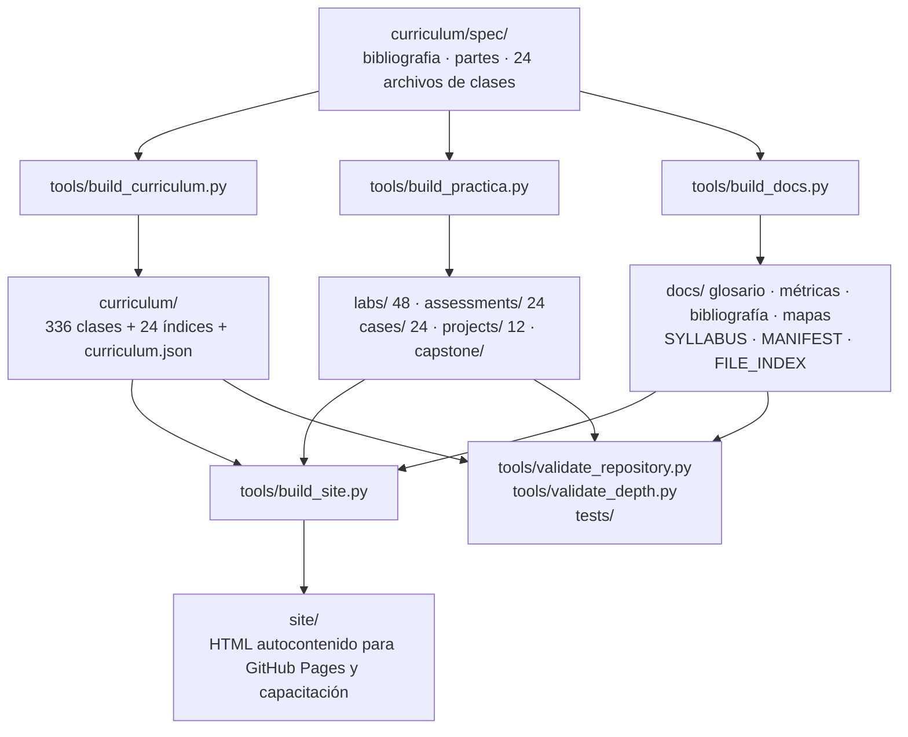

# Arquitectura del programa

Cómo está construido el repositorio, por qué el contenido se genera y cómo se mantiene coherente a lo largo
del tiempo.

## 1. Principio de diseño

> **El Markdown publicado es una salida, no la fuente.** La fuente de verdad pedagógica vive en
> `curriculum/spec/`. Editar el Markdown a mano se pierde en la siguiente generación.

Este principio resuelve el problema que degrada los repositorios educativos grandes: la deriva. Cuando 336
clases se editan a mano, terminan con estructuras distintas, métricas inconsistentes y bibliografía
divergente. Generarlas desde una especificación garantiza que todas cumplan el mismo estándar.

## 2. Flujo de construcción



## 3. Estructura del repositorio

```text
marketing-sales-growth-evolution-program/
├── curriculum/
│   ├── spec/                    fuente de verdad pedagógica
│   │   ├── bibliografia.py      96 obras con su lente
│   │   ├── partes.py            24 partes, caso persistente y niveles
│   │   └── clases_pNN.py        14 especificaciones de clase por parte
│   ├── part-NN-slug/            salida generada: 14 clases + README
│   ├── curriculum.json          índice legible por máquina
│   └── README.md                índice del currículo
├── labs/part-NN/                48 laboratorios
├── assessments/                 24 evaluaciones con rúbrica ponderada
├── cases/                       24 casos extendidos con complicación
├── projects/                    12 proyectos integradores
├── capstone/                    Capstone y checklist
├── datasets/                    5 conjuntos sintéticos reproducibles
├── notebooks/                   8 notebooks de analítica
├── templates/                   plantillas de artefactos
├── simulations/                 estado persistente de la empresa simulada
├── ai/                          prompts, agentes y guardarraíles
├── docs/                        documentación del programa
├── tools/                       generadores y validadores
├── tests/                       pruebas del repositorio
├── apps/learning-dashboard/     seguimiento local sin dependencias
└── site/                        sitio HTML generado
```

## 4. Modelo de datos de una clase

Cada clase se especifica con esta estructura:

```python
dict(
    n="04",                       # número dentro de la parte
    slug="value-based-pricing",   # identificador estable
    titulo="Pricing basado en valor",
    tesis="...",                  # 70 a 110 palabras de contenido sustantivo
    conceptos=[("término", "definición operacional"), ...],   # 4
    metodo=["paso 1", ..., "paso 5"],                          # 5
    senales=[("métrica", "numerador / denominador / ventana"), ...],  # 3
    caso="...",                   # situación con datos concretos
    limite="...",                 # frontera de aplicación
    libros=["nagle", "ramanujam", "simon", "hubbard"],         # 2 a 4
    error=("síntoma frecuente", "corrección concreta"),
)
```

El renderizador expande esa especificación en una clase de 3.000 a 4.100 palabras con 18 secciones. La
variación de redacción se distribuye por índice para evitar que las clases consecutivas se lean idénticas.

## 5. Trazabilidad

Cada elemento del repositorio puede rastrearse hasta su origen:

| Elemento publicado | Origen |
|---|---|
| Clase | `curriculum/spec/clases_pNN.py` |
| Glosario | Conceptos de todas las clases |
| Fórmulas y métricas | Señales de todas las clases |
| Bibliografía | `curriculum/spec/bibliografia.py` + uso por clase |
| Laboratorio | Clases ancla de la parte + artefacto de la parte |
| Evaluación | Conceptos, método y bibliografía de la parte |
| Caso | Caso y riesgo de la parte |
| Manifiesto | Conteo de archivos reales |

Cambiar una definición en la especificación actualiza automáticamente la clase, el glosario, el laboratorio
y la evaluación asociados. Esa es la razón de la arquitectura.

## 6. Comandos

```bash
python tools/build_curriculum.py       # 336 clases + índices + JSON
python tools/build_practica.py         # labs, evaluaciones, casos, proyectos, capstone
python tools/build_docs.py             # glosario, métricas, bibliografía, syllabus, manifiesto
python tools/build_site.py             # sitio HTML autocontenido
python tools/build_status.py           # estado del repositorio
python tools/validate_repository.py    # validación estructural
python tools/validate_depth.py         # profundidad mínima por clase
python tools/check_links.py            # enlaces internos rotos
python -m pytest -q                    # pruebas
```

Todos los generadores usan sólo la biblioteca estándar de Python: validar y construir el material no debe
exigir instalar nada. El sitio HTML tampoco requiere dependencias.

## 7. Decisiones de arquitectura y sus razones

| Decisión | Razón |
|---|---|
| Contenido generado desde especificación | Evita la deriva de estructura y de estándar en 336 documentos |
| Sólo biblioteca estándar en los generadores | El material debe poder construirse sin instalar dependencias |
| Un caso persistente en todo el programa | Permite acumulación: las decisiones condicionan a las siguientes |
| Bibliografía centralizada con «lente» | Obliga a declarar para qué sirve cada obra, no sólo citarla |
| Definiciones operacionales obligatorias | Hace verificable el aprendizaje y elimina el vocabulario decorativo |
| Rúbricas publicadas en el material | Evaluar con criterios ocultos mide adivinación |
| Cumplimiento normativo como sección fija | Convierte la ley en restricción de diseño, no en advertencia final |
| Sitio HTML autocontenido | Permite migrar a capacitación sin reescribir contenido |

## 8. Cómo extender el programa

Para agregar o modificar contenido:

1. Edita la especificación en `curriculum/spec/`.
2. Ejecuta los generadores.
3. Ejecuta la validación y las pruebas.
4. Verifica el resultado en el Markdown generado.
5. Regenera el sitio si el cambio debe publicarse.

Nunca edites directamente `curriculum/part-*/`, `labs/`, `assessments/`, `cases/`, `projects/` ni los
documentos marcados como `generated: true`.

---

[⬅ Documentación](README.md) · [Metodología](METODOLOGIA.md) · [Contribuir](../CONTRIBUTING.md)
