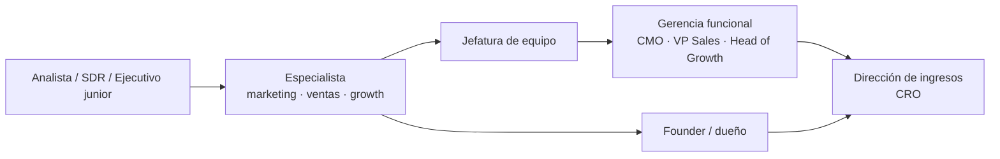

# Rutas profesionales

Qué roles existen en la función comercial, qué se espera de cada uno y qué partes del programa los preparan.

> **Advertencia.** Este programa no certifica ni garantiza empleo. Lo que acredita es evidencia de trabajo:
> los artefactos producidos son la credencial y deben poder defenderse ante preguntas técnicas.

## 1. Mapa general de roles

## 2. Roles de entrada

### Analista comercial o de marketing

**Qué se espera:** producir evidencia confiable, documentar método y declarar límites del dato.

**Partes clave:** 01, 02, 03, 20.

**Artefactos que lo acreditan:** informe de oportunidad de mercado, árbol de métricas, caso analítico
integral.

**Pregunta típica de entrevista:** «Este número bajó 12 % este mes. ¿Qué haces?» — La respuesta esperada
empieza por verificar si la variación está dentro del rango normal.

### SDR / BDR (desarrollo de ventas)

**Qué se espera:** originar conversaciones calificadas con disciplina de actividad y mensajes pertinentes.

**Partes clave:** 02, 08, 11, 16.

**Artefactos:** sistema de prospección repetible, secuencias multicanal, criterios de calificación.

**Pregunta típica:** «¿Cuántos intentos hacen falta para una reunión en tu segmento?» — Se espera un número
con su fuente, no una impresión.

### Ejecutivo comercial junior

**Qué se espera:** ejecutar el proceso comercial completo sin depender de acompañamiento constante.

**Partes clave:** 08, 09, 10, 16.

**Artefactos:** playbook comercial, deal review, carpeta de negociación.

## 3. Roles de especialista

### Marketing manager

**Partes clave:** 01, 02, 04, 06, 12, 13, 14, 20.

**Artefactos:** arquitectura STP, brand book mínimo viable, plan de adquisición, auditoría digital.

**Lo que distingue a un buen candidato:** puede explicar qué parte de su resultado es incremental y qué parte
habría ocurrido igual.

### Product marketing

**Partes clave:** 02, 03, 04, 05, 22.

**Artefactos:** expediente de cliente, oferta lista para vender, declaración de posicionamiento probada.

### Growth manager

**Partes clave:** 12, 15, 18, 19, 20, 21.

**Artefactos:** growth model, backlog de experimentos, resultados con criterio previo.

**Lo que distingue:** puede nombrar tres experimentos que refutaron su hipótesis y qué cambió después.

### Account executive

**Partes clave:** 08, 09, 10, 16.

**Artefactos:** deal review con mapa de comité, plan mutuo, acuerdo documentado.

### Customer success manager

**Partes clave:** 05, 18, 20.

**Artefactos:** sistema de retención y expansión, health score validado, ciclo de renovación.

### Sales operations / RevOps

**Partes clave:** 16, 17, 20, 23.

**Artefactos:** diseño de sales operations, operating model de RevOps, modelo de datos de ingresos.

**Lo que distingue:** puede explicar por qué dos áreas reportan cifras distintas y cómo se resuelve.

### E-commerce manager

**Partes clave:** 12, 13, 15, 20.

**Artefactos:** simulación de tienda rentable, economía por pedido, plan postventa conforme a la normativa.

## 4. Roles de jefatura y gerencia

### Jefe de ventas

**Partes clave:** 08–11, 16, 23.

**Qué cambia respecto del rol anterior:** ya no responde por su propio resultado sino por el del equipo, y
debe distinguir problemas de capacidad, de claridad y de territorio.

### CMO / Head of Marketing

**Partes clave:** 04, 06, 12–14, 20, 22, 23.

**Qué se espera:** asignar presupuesto con criterio de eficiencia, sostener la construcción de marca frente a
la presión de corto plazo y responder por el resultado ante el directorio.

### VP Sales

**Partes clave:** 09, 10, 16, 22, 23.

**Qué se espera:** forecast confiable, diseño de cuotas y territorios, y un sistema que no dependa de dos
vendedores estrella.

### CRO (Chief Revenue Officer)

**Partes clave:** todo el programa, con énfasis en 16–24.

**Qué se espera:** dirigir marketing, ventas y éxito de cliente como un solo sistema, con un modelo de datos
común y una economía unitaria verificada.

**Artefacto:** operating system del CRO.

## 5. Founder y dueño

**Partes clave:** 01–08, 11, 12, 22, 24.

**Qué cambia:** la pregunta no es sólo si funciona, sino si funciona sin depender del fundador y si preserva
caja.

**Artefacto:** Capstone completo con cumplimiento normativo verificado.

## 6. Qué mira quien contrata

Con independencia del rol, tres señales pesan más que el currículo:

1. **Puede mostrar trabajo.** Un artefacto real supera a cualquier descripción de responsabilidades.
2. **Distingue lo que sabe de lo que supone.** Quien declara sus límites genera más confianza que quien
   afirma con seguridad uniforme.
3. **Conecta su trabajo con el resultado del negocio.** «Aumenté el tráfico» vale menos que «reduje el costo
   por oportunidad calificada de X a Y, y aquí está el cálculo».

## 7. Cómo usar el portafolio en una postulación

| Rol al que postulas | Artefactos a mostrar |
|---|---|
| Analista | Informe de oportunidad de mercado, caso analítico |
| Marketing manager | Arquitectura STP, plan de adquisición, auditoría digital |
| Ejecutivo comercial | Playbook, deal review, carpeta de negociación |
| Growth | Growth model, tres experimentos con criterio previo |
| Customer success | Sistema de retención, health score validado |
| RevOps | Modelo de datos, diseño de sales operations |
| Dirección | Operating system del CRO, Capstone completo |

Documenta cada artefacto con: problema, método, decisiones tomadas y descartadas, resultado o aprendizaje.

---

[⬅ Documentación](README.md) · [Mapa de competencias](MAPA-DE-COMPETENCIAS.md) ·
[Ruta de aprendizaje](RUTA-DE-APRENDIZAJE.md)
