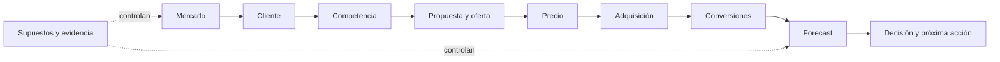

# Commercial Evidence Pack

> **De evidencia dispersa a una decisión comercial defendible.**
>
> Esta guía conecta lo aprendido en el programa con un entregable ejecutivo, auditable y actualizable.

| Control del documento | Completar |
|---|---|
| **Decisión que debe informar** |  |
| **Empresa / unidad / segmento** |  |
| **Responsable** |  |
| **Fecha de corte** |  |
| **Próxima revisión** |  |
| **Estado** | Borrador / En revisión / Aprobado / Requiere nueva evidencia |

## Qué vas a producir

| Pieza | Extensión orientativa | Propósito |
|---|---:|---|
| **Resumen ejecutivo** | 1–2 páginas | Permitir que una persona decida sin recorrer todos los anexos |
| **Diez bloques de evidencia** | Sólo lo necesario | Mostrar cómo mercado, cliente y operación sostienen la recomendación |
| **Anexos enlazados** | Sin límite artificial | Conservar entrevistas, cálculos, fuentes y datos sin saturar el resumen |
| **Registro de incertidumbres** | Una fila por supuesto crítico | Evitar que una estimación o una hipótesis se presente como certeza |

Este paquete **no sustituye** entrevistas, cálculos, anexos ni una proyección financiera. Funciona como
índice ejecutivo: cada conclusión debe conducir a la evidencia que la sostiene.

## Mapa del sistema comercial

La lógica de lectura es izquierda a derecha. Si una cifra del forecast no puede regresar hasta mercado,
cliente o evidencia operativa, no es una conclusión: es un supuesto todavía oculto.

## Cómo usar esta guía

1. **Define la decisión.** No empieces por completar tablas; escribe qué decisión debe cambiar con el análisis.
2. **Reutiliza evidencia existente.** Enlaza entrevistas, cálculos y artefactos del programa; no los copies.
3. **Abre la clase de apoyo.** Cada bloque contiene enlaces directos a la explicación, ejemplo y práctica.
4. **Completa sólo lo aplicable.** Cuando algo no corresponda, escribe `no aplica` y explica la razón.
5. **Prueba la coherencia.** Recorre el paquete desde forecast hacia atrás hasta llegar a evidencia verificable.
6. **Cierra con una decisión condicionada.** Declara qué recomiendas, qué podría cambiarla y cuándo revisar.

> [!TIP]
> Si es tu primera vez, comienza por la
> [Clase 24.11 — Commercial Evidence Pack y dashboard comercial](../../curriculum/part-24-empresa-real-regulacion-y-capstone/class-11-dashboard-financiero-comercial.md).
> Después abre únicamente las clases del bloque que estés completando.

## Ruta de aprendizaje y enlaces directos

| Bloque | Pregunta que resuelve | Clases principales | Resultado esperado |
|---|---|---|---|
| [1. Mercado](#1-mercado) | ¿Existe una oportunidad suficientemente clara y vigente? | [03.08 TAM/SAM/SOM](../../curriculum/part-03-investigacion-de-mercados-e-inteligencia-competitiva/class-08-tam-sam-y-som.md) · [03.11 Señales](../../curriculum/part-03-investigacion-de-mercados-e-inteligencia-competitiva/class-11-social-listening-y-senales-de-mercado.md) · [03.14 Informe ejecutivo](../../curriculum/part-03-investigacion-de-mercados-e-inteligencia-competitiva/class-14-informe-de-oportunidad-de-mercado.md) | Mercado priorizado con evidencia, rango y vigencia |
| [2. Cliente](#2-cliente) | ¿Para quién resolvemos qué progreso y con qué evidencia? | [02.03 JTBD](../../curriculum/part-02-cliente-y-comportamiento-del-consumidor/class-03-jobs-to-be-done.md) · [02.05 ICP](../../curriculum/part-02-cliente-y-comportamiento-del-consumidor/class-05-ideal-customer-profile.md) · [02.14 Expediente](../../curriculum/part-02-cliente-y-comportamiento-del-consumidor/class-14-sintesis-expediente-de-cliente-accionable.md) | Cadena cliente–decisión trazable |
| [3. Competencia](#3-competencia-y-benchmarks) | ¿Frente a qué alternativa debemos igualar o diferenciarnos? | [03.09 Benchmarking](../../curriculum/part-03-investigacion-de-mercados-e-inteligencia-competitiva/class-09-benchmarking-competitivo.md) · [03.10 Competencia](../../curriculum/part-03-investigacion-de-mercados-e-inteligencia-competitiva/class-10-analisis-de-competencia.md) | Comparación reproducible, no adjetivos |
| [4. Propuesta](#4-propuesta-y-oferta) | ¿Qué prometemos, entregamos y excluimos? | [05.02 Propuesta de valor](../../curriculum/part-05-producto-oferta-y-propuesta-de-valor/class-02-value-proposition-canvas.md) · [05.06 Oferta](../../curriculum/part-05-producto-oferta-y-propuesta-de-valor/class-06-diseno-de-ofertas.md) · [05.14 Oferta vendible](../../curriculum/part-05-producto-oferta-y-propuesta-de-valor/class-14-oferta-lista-para-vender.md) | Oferta coherente con cliente y competencia |
| [5. Precio](#5-precio-y-economía-comercial) | ¿El precio es defendible y la adquisición sostenible? | [07.05 WTP](../../curriculum/part-07-pricing-y-monetizacion/class-05-willingness-to-pay.md) · [07.12 Unit economics](../../curriculum/part-07-pricing-y-monetizacion/class-12-unit-economics.md) · [20.03 CAC](../../curriculum/part-20-analitica-comercial-y-marketing-science/class-03-cac.md) · [20.04 LTV](../../curriculum/part-20-analitica-comercial-y-marketing-science/class-04-ltv.md) | Rango de precio y límites económicos explícitos |
| [6. Adquisición](#6-adquisición) | ¿Qué canal puede producir demanda atendible y a qué costo? | [14.08 Presupuesto](../../curriculum/part-14-publicidad-y-performance-marketing/class-08-presupuesto-y-pacing.md) · [14.10 CPA/CAC/ROAS](../../curriculum/part-14-publicidad-y-performance-marketing/class-10-cpa-cac-y-roas.md) · [14.14 Plan](../../curriculum/part-14-publicidad-y-performance-marketing/class-14-plan-de-performance-marketing.md) | Plan de volumen, costo, calidad y capacidad |
| [7. Conversiones](#7-conversiones) | ¿Cómo se transforma la demanda en clientes e ingreso? | [17.10 Revenue funnel](../../curriculum/part-17-marketing-automation-y-revenue-operations/class-10-revenue-funnel.md) · [20.02 Conversión](../../curriculum/part-20-analitica-comercial-y-marketing-science/class-02-conversion-y-funnels.md) | Modelo de etapas con criterios y tasas |
| [8. Forecast](#8-forecast-comercial) | ¿Qué resultado es defendible bajo capacidad e incertidumbre? | [16.07 Forecast](../../curriculum/part-16-crm-pipeline-y-sales-operations/class-07-forecast.md) · [16.09 Capacidad](../../curriculum/part-16-crm-pipeline-y-sales-operations/class-09-sales-capacity.md) · [17.11 Forecast unificado](../../curriculum/part-17-marketing-automation-y-revenue-operations/class-11-forecast-unificado.md) | Escenarios, restricciones y confianza calibrada |
| [9. Supuestos](#9-registro-de-supuestos) | ¿Qué tendría que ser cierto y cómo lo refutaremos? | [03.13 Validación](../../curriculum/part-03-investigacion-de-mercados-e-inteligencia-competitiva/class-13-validacion-de-hipotesis-comerciales.md) · [Estándar de evidencia](../../docs/ESTANDAR-DE-EVIDENCIA.md) | Registro con sensibilidad, dueño y fecha |
| [10. Decisión](#10-evidencias-incertidumbres-y-decisión) | ¿Qué haremos, por qué y qué nos haría cambiar? | [17.14 Operating model RevOps](../../curriculum/part-17-marketing-automation-y-revenue-operations/class-14-operating-model-revops.md) · [24.11 Integración](../../curriculum/part-24-empresa-real-regulacion-y-capstone/class-11-dashboard-financiero-comercial.md) | Recomendación condicionada y gobernada |

### Qué encontrarás al abrir una clase

| Sección de la clase | Cómo te ayuda a completar el paquete |
|---|---|
| **Propósito y resultados de aprendizaje** | Aclaran qué decisión serás capaz de tomar y qué evidencia debes producir |
| **Conceptos y desarrollo** | Definen el método, sus límites, errores de clasificación y métricas |
| **Ejemplo trabajado** | Muestra el cálculo o razonamiento aplicado a un caso con cifras |
| **Comparación y caso ejecutivo** | Obligan a evaluar alternativas, trade-offs y efectos de segundo orden |
| **Práctica guiada** | Convierte la explicación en pasos verificables antes de completar tu bloque |
| **Entregable y evaluación** | Indican archivos esperados, criterio de aprobación y evidencia mínima |
| **Fuentes y verificación** | Identifican la obra, idea y ubicación que sostienen el contenido |

Las clases enlazadas no son lecturas nominales. Cada una contiene desarrollo completo, aplicación, control de
comprensión y un entregable que alimenta uno o más bloques de esta guía.

## Convención de evidencia

| Tipo | Qué significa | Requisito mínimo | Ejemplo breve |
|---|---|---|---|
| **Dato** | Observación registrada | Fuente, fecha, población o contexto y definición | 42 de 180 oportunidades cerraron |
| **Estimación** | Cálculo sobre datos y supuestos | Método, rango, sensibilidad y fuente de variables | SOM entre 120 y 180 cuentas |
| **Hipótesis** | Afirmación pendiente de prueba | Criterio de refutación, próxima prueba, responsable y fecha | El segmento pagará CLP 90.000 al mes |
| **Inferencia** | Interpretación de uno o más datos | Evidencia de origen, razonamiento y explicación alternativa | La caída puede deberse al canal, no al mensaje |

Para conocimiento del cliente, registra uno de estos orígenes: **entrevista**, **observación**, **dato de
comportamiento**, **encuesta** o **hipótesis no validada**. Un mapa de empatía puede sintetizar esas fuentes;
no puede inventar afirmaciones para llenar cuadrantes.

### Ejemplo: de una frase débil a evidencia utilizable

| Insuficiente | Utilizable |
|---|---|
| “Las pymes necesitan automatización.” | **Inferencia:** 7 de 10 entrevistados describieron al menos cuatro horas semanales de conciliación manual. Entrevistas E-01 a E-10, agosto de 2026. Alternativa: el problema puede ser capacitación, no ausencia de software. |
| “La conversión será 8 %.” | **Estimación:** rango 5–8 %, basado en dos cohortes comparables; escenario base 6 %, revisión al acumular 100 SQL. |

## 1. Mercado

**Pregunta ejecutiva:** ¿qué oportunidad merece recursos ahora y qué evidencia limita esa conclusión?

**Salida mínima:** una página de inteligencia comercial y un anexo con fuentes.

**Profundiza en:** [03.08 TAM/SAM/SOM](../../curriculum/part-03-investigacion-de-mercados-e-inteligencia-competitiva/class-08-tam-sam-y-som.md), [03.09 Benchmarking](../../curriculum/part-03-investigacion-de-mercados-e-inteligencia-competitiva/class-09-benchmarking-competitivo.md), [03.10 Competencia](../../curriculum/part-03-investigacion-de-mercados-e-inteligencia-competitiva/class-10-analisis-de-competencia.md), [03.11 Señales](../../curriculum/part-03-investigacion-de-mercados-e-inteligencia-competitiva/class-11-social-listening-y-senales-de-mercado.md) y [03.14 Informe ejecutivo](../../curriculum/part-03-investigacion-de-mercados-e-inteligencia-competitiva/class-14-informe-de-oportunidad-de-mercado.md).

| Elemento | Hallazgo ejecutivo | Tipo | Fuente y fecha | Incertidumbre / vigencia | Implicación |
|---|---|---|---|---|---|
| Mercado y categoría |  |  |  |  |  |
| Segmentos y prioridad |  |  |  |  |  |
| TAM / SAM / SOM |  |  |  |  |  |
| Cuota, sólo con fuente confiable |  |  |  |  |  |
| Tendencias y señales de demanda |  |  |  |  |  |
| Canales y precios observables |  |  |  |  |  |

> **Control de calidad:** si no existe una fuente confiable para cuota, usa participación en negocios
> observados o declara `no disponible`. Nunca presentes una estimación como dato de mercado.

## 2. Cliente

**Pregunta ejecutiva:** ¿cómo sabemos que el segmento elegido tiene el problema y comprará esta solución?

**Salida mínima:** cadena completa desde segmento hasta acción de venta, con procedencia por eslabón.

**Profundiza en:** [02.03 JTBD](../../curriculum/part-02-cliente-y-comportamiento-del-consumidor/class-03-jobs-to-be-done.md), [02.04 Persona con evidencia](../../curriculum/part-02-cliente-y-comportamiento-del-consumidor/class-04-buyer-persona-con-evidencia.md), [02.05 ICP](../../curriculum/part-02-cliente-y-comportamiento-del-consumidor/class-05-ideal-customer-profile.md), [03.03 Entrevistas](../../curriculum/part-03-investigacion-de-mercados-e-inteligencia-competitiva/class-03-diseno-de-entrevistas.md) y [02.14 Expediente accionable](../../curriculum/part-02-cliente-y-comportamiento-del-consumidor/class-14-sintesis-expediente-de-cliente-accionable.md).

| Eslabón | Conclusión o decisión | Origen | Evidencia enlazada | Pendiente / próxima prueba |
|---|---|---|---|---|
| Segmento |  |  |  |  |
| ICP: inclusión y exclusión |  |  |  |  |
| Entrevistas y observaciones |  |  |  |  |
| JTBD y disparador |  |  |  |  |
| Pains / gains |  |  |  |  |
| Propuesta de valor |  |  |  |  |
| Mensaje |  |  |  |  |
| Oferta |  |  |  |  |
| Canal |  |  |  |  |
| Acción de venta |  |  |  |  |

> **Control de calidad:** recorre la tabla de abajo hacia arriba. Si una decisión no puede regresar a una
> entrevista, observación, conducta o encuesta, márcala como hipótesis no validada.

## 3. Competencia y benchmarks

**Pregunta ejecutiva:** ¿en qué debemos alcanzar paridad y dónde conviene diferenciarnos?

**Salida mínima:** protocolo reproducible, evidencia por alternativa y una conclusión de inversión.

**Profundiza en:** [03.09 Benchmarking competitivo](../../curriculum/part-03-investigacion-de-mercados-e-inteligencia-competitiva/class-09-benchmarking-competitivo.md) y [03.10 Análisis de competencia](../../curriculum/part-03-investigacion-de-mercados-e-inteligencia-competitiva/class-10-analisis-de-competencia.md).

**Muestra:** · **Segmento comparado:** · **Fecha de corte:** · **Regla de comparación:**

### Observaciones comparables

| Alternativa | Propuesta y segmento | Precio y packaging | Canal y experiencia | Fuente y fecha |
|---|---|---|---|---|
| Empresa |  |  |  |  |
| Competidor directo 1 |  |  |  |  |
| Competidor directo 2 |  |  |  |  |
| Sustituto |  |  |  |  |
| No hacer nada |  |  |  |  |

### Conclusión competitiva

| Alternativa | Posicionamiento | Fortaleza observable | Debilidad observable | Inferencia separada | Decisión |
|---|---|---|---|---|---|
|  |  |  |  |  |  |

> **Control de calidad:** usa `no observable` cuando falte evidencia. Fortaleza y debilidad son diferencias
> demostrables para el segmento; cualquier explicación causal se registra como inferencia.

## 4. Propuesta y oferta

**Pregunta ejecutiva:** ¿qué prometemos, a quién, bajo qué condiciones y con qué reducción de riesgo?

**Salida mínima:** oferta comprensible y ejecutable sin la presencia de su autor.

**Profundiza en:** [05.02 Value Proposition Canvas](../../curriculum/part-05-producto-oferta-y-propuesta-de-valor/class-02-value-proposition-canvas.md), [05.06 Diseño de ofertas](../../curriculum/part-05-producto-oferta-y-propuesta-de-valor/class-06-diseno-de-ofertas.md), [05.07 Packaging](../../curriculum/part-05-producto-oferta-y-propuesta-de-valor/class-07-packaging-y-bundling.md), [05.08 Garantías](../../curriculum/part-05-producto-oferta-y-propuesta-de-valor/class-08-garantias-y-reduccion-de-riesgo.md), [05.12 Voice of Customer](../../curriculum/part-05-producto-oferta-y-propuesta-de-valor/class-12-voice-of-customer.md) y [05.14 Oferta lista para vender](../../curriculum/part-05-producto-oferta-y-propuesta-de-valor/class-14-oferta-lista-para-vender.md).

| Elemento | Decisión | Evidencia de cliente | Evidencia competitiva | Hipótesis pendiente | Revisión |
|---|---|---|---|---|---|
| Propuesta de valor |  |  |  |  |  |
| Mensaje |  |  |  |  |  |
| Alcance y exclusiones |  |  |  |  |  |
| Garantía o reducción de riesgo |  |  |  |  |  |
| Packaging |  |  |  |  |  |

## 5. Precio y economía comercial

**Pregunta ejecutiva:** ¿qué precio es defendible y bajo qué límites económicos podemos adquirir clientes?

**Salida mínima:** rango de precio, sensibilidad y restricciones de CAC, LTV, margen y payback.

**Profundiza en:** [07.03 Pricing competitivo](../../curriculum/part-07-pricing-y-monetizacion/class-03-competitor-based-pricing.md), [07.05 Willingness to Pay](../../curriculum/part-07-pricing-y-monetizacion/class-05-willingness-to-pay.md), [07.12 Unit economics](../../curriculum/part-07-pricing-y-monetizacion/class-12-unit-economics.md), [20.03 CAC](../../curriculum/part-20-analitica-comercial-y-marketing-science/class-03-cac.md), [20.04 LTV](../../curriculum/part-20-analitica-comercial-y-marketing-science/class-04-ltv.md), [20.05 Payback](../../curriculum/part-20-analitica-comercial-y-marketing-science/class-05-payback.md) y [20.06 Margen de contribución](../../curriculum/part-20-analitica-comercial-y-marketing-science/class-06-contribution-margin.md).

| Variable | Valor / rango | Fuente o fórmula | Tipo | Sensibilidad | Límite de uso |
|---|---:|---|---|---|---|
| Precio observable |  |  |  |  |  |
| Disposición a pagar |  |  |  |  |  |
| Ticket o ingreso medio |  |  |  |  |  |
| Frecuencia |  |  |  |  |  |
| CAC completo |  |  |  |  |  |
| Margen de contribución |  |  |  |  |  |
| LTV |  |  |  |  |  |
| Periodo de recuperación |  |  |  |  |  |

> **Límite de alcance:** este bloque prepara restricciones para el forecast. No modela caja, balance ni estados
> financieros y no sustituye una proyección financiera.

## 6. Adquisición

**Pregunta ejecutiva:** ¿qué canal puede generar demanda de calidad sin superar costo ni capacidad?

**Salida mínima:** volumen, costo, calidad, capacidad y regla de inversión por canal.

**Profundiza en:** [14.08 Presupuesto y pacing](../../curriculum/part-14-publicidad-y-performance-marketing/class-08-presupuesto-y-pacing.md), [14.10 CPA, CAC y ROAS](../../curriculum/part-14-publicidad-y-performance-marketing/class-10-cpa-cac-y-roas.md), [14.14 Plan de performance](../../curriculum/part-14-publicidad-y-performance-marketing/class-14-plan-de-performance-marketing.md) y [16.09 Sales capacity](../../curriculum/part-16-crm-pipeline-y-sales-operations/class-09-sales-capacity.md).

| Canal / movimiento | Unidad de entrada | Volumen | Costo | Calidad | Capacidad | Evidencia / supuesto |
|---|---|---:|---:|---|---:|---|
|  |  |  |  |  |  |  |

## 7. Conversiones

**Pregunta ejecutiva:** ¿qué pasos verificables convierten demanda en clientes e ingreso?

**Salida mínima:** modelo de etapas con criterio de entrada/salida, volumen, conversión y duración.

**Profundiza en:** [17.10 Revenue funnel](../../curriculum/part-17-marketing-automation-y-revenue-operations/class-10-revenue-funnel.md) y [20.02 Conversión y funnels](../../curriculum/part-20-analitica-comercial-y-marketing-science/class-02-conversion-y-funnels.md).

Elige el modelo que describe el negocio. No añadas MQL o SQL si no cambian una decisión.

### Modelo B2B

| Etapa | Criterio operacional | Volumen | Conversión | Duración / cohorte | Fuente |
|---|---|---:|---:|---|---|
| Visitas o alcance |  |  |  |  |  |
| Leads |  |  |  |  |  |
| MQL, cuando aplique |  |  |  |  |  |
| SQL |  |  |  |  |  |
| Oportunidades |  |  |  |  |  |
| Cierres |  |  |  |  |  |
| Clientes |  |  |  |  |  |
| Ingreso |  |  |  |  |  |

### Modelo alternativo

Marca uno: **e-commerce / suscripción / PLG / canal indirecto / otro**.

| Etapa o unidad | Criterio operacional | Volumen | Transición | Valor | Fuente |
|---|---|---:|---:|---:|---|
|  |  |  |  |  |  |

## 8. Forecast comercial

**Pregunta ejecutiva:** ¿qué rango de resultado puede defenderse bajo las restricciones observadas?

**Salida mínima:** escenarios, componentes separados, límites operativos y confianza calibrada.

**Profundiza en:** [16.07 Forecast de pipeline](../../curriculum/part-16-crm-pipeline-y-sales-operations/class-07-forecast.md), [16.09 Sales capacity](../../curriculum/part-16-crm-pipeline-y-sales-operations/class-09-sales-capacity.md), [16.10 Sales velocity](../../curriculum/part-16-crm-pipeline-y-sales-operations/class-10-sales-velocity.md), [17.11 Forecast unificado](../../curriculum/part-17-marketing-automation-y-revenue-operations/class-11-forecast-unificado.md) y [20.11 Forecasting](../../curriculum/part-20-analitica-comercial-y-marketing-science/class-11-forecasting.md).

| Componente | Conservador | Base | Optimista | Supuestos críticos | Evidencia | Precisión histórica |
|---|---:|---:|---:|---|---|---:|
| Ingreso nuevo |  |  |  |  |  |  |
| Renovación |  |  |  |  |  |  |
| Expansión |  |  |  |  |  |  |
| Contracción |  |  |  |  |  |  |
| Churn |  |  |  |  |  |  |
| Ingreso neto |  |  |  |  |  |  |

| Control | Valor / rango | Restricción que impone |
|---|---:|---|
| Sales cycle |  |  |
| Pipeline coverage |  |  |
| Capacidad comercial y rampa |  |  |
| CAC / LTV / payback |  |  |
| Concentración del forecast |  |  |

**Confianza del forecast:** Alta / Media / Baja.

**Justificación:** calidad y vigencia de evidencia, cobertura, concentración, estabilidad, capacidad y precisión
histórica. La confianza expresa calibración, nunca certeza.

## 9. Registro de supuestos

**Pregunta ejecutiva:** ¿qué tendría que ser cierto para que la decisión funcione?

**Salida mínima:** supuesto refutable, sensibilidad, responsable y fecha de revisión.

**Profundiza en:** [03.13 Validación de hipótesis](../../curriculum/part-03-investigacion-de-mercados-e-inteligencia-competitiva/class-13-validacion-de-hipotesis-comerciales.md) y [Estándar de evidencia](../../docs/ESTANDAR-DE-EVIDENCIA.md).

| ID | Supuesto | Tipo | Evidencia actual | Sensibilidad | Criterio de refutación | Responsable | Revisión |
|---|---|---|---|---|---|---|---|
| S-01 |  |  |  |  |  |  |  |

## 10. Evidencias, incertidumbres y decisión

**Pregunta ejecutiva:** ¿qué haremos ahora, con qué confianza y bajo qué condición cambiaremos?

**Salida mínima:** recomendación condicionada, alternativa descartada y próxima acción gobernada.

**Profundiza en:** [17.14 Operating model RevOps](../../curriculum/part-17-marketing-automation-y-revenue-operations/class-14-operating-model-revops.md) y [24.11 Commercial Evidence Pack](../../curriculum/part-24-empresa-real-regulacion-y-capstone/class-11-dashboard-financiero-comercial.md).

| Conclusión | Evidencia que la sostiene | Incertidumbre restante | Qué la haría cambiar | Próxima acción |
|---|---|---|---|---|
|  |  |  |  |  |

### Resumen ejecutivo

- **Decisión solicitada:**
- **Recomendación condicionada:**
- **Evidencia más fuerte:**
- **Alternativa descartada y costo de oportunidad:**
- **Tres incertidumbres que más mueven el resultado:**
- **Condición de revisión o detención:**
- **Responsable y fecha:**

## Revisión final antes de entregar

- [ ] La recomendación responde a una decisión explícita.
- [ ] Cada cifra importante enlaza a fuente, cálculo o registro de origen.
- [ ] Dato, Estimación, Hipótesis e Inferencia están diferenciados.
- [ ] Cliente, propuesta, precio, canal, conversiones y forecast forman una cadena coherente.
- [ ] El forecast respeta Pipeline coverage, Capacidad comercial, sales cycle y economía comercial.
- [ ] La Confianza del forecast está justificada y no se presenta como certeza.
- [ ] Los campos no aplicables explican por qué; no quedan vacíos silenciosos.
- [ ] Otra persona puede reconstruir la decisión sin la presencia del autor.
- [ ] Existe responsable y fecha para cada supuesto crítico.
- [ ] El paquete alimenta —pero no intenta reemplazar— una proyección financiera posterior.

---

> [!IMPORTANT]
> Completa cada campo o elimínalo declarando por qué no aplica. Un campo vacío sin explicación se evalúa como
> omisión. Los enlaces llevan a clases completas con desarrollo, ejemplo trabajado, práctica, evaluación y
> fuentes; no son referencias nominales.

**Siguiente paso:** [abrir la Clase 24.11](../../curriculum/part-24-empresa-real-regulacion-y-capstone/class-11-dashboard-financiero-comercial.md)
o [volver al Capstone](../../capstone/README.md).

[⬅ Plantillas](../) · [Auditoría antes/después](../../docs/AUDITORIA-COMMERCIAL-EVIDENCE.md) ·
[Estándar de evidencia](../../docs/ESTANDAR-DE-EVIDENCIA.md)
